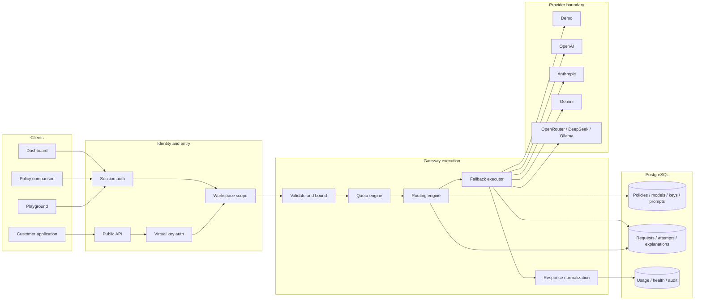
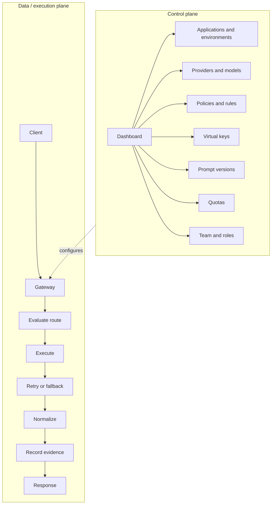
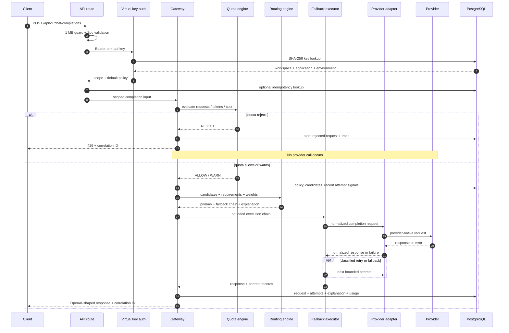
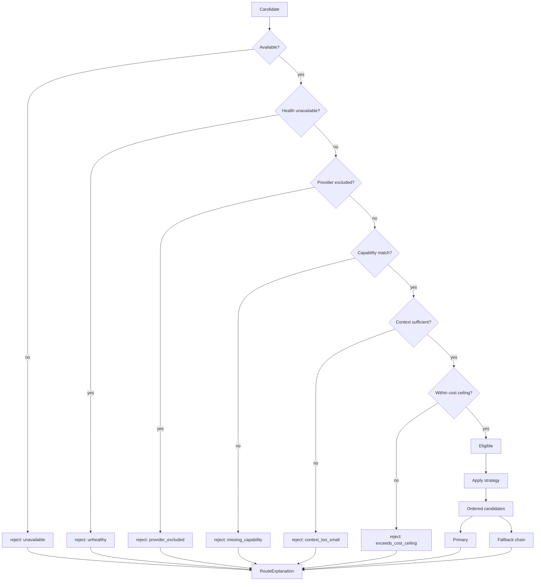

# OmniRouter

### AI Model Gateway, Routing &amp; Reliability Control Plane

One OpenAI-shaped endpoint for policy-driven model selection across providers. OmniRouter authenticates virtual keys, enforces usage constraints, explains every routing decision, executes bounded retry and fallback, normalizes provider behavior, and persists the evidence operators need.

[**Demo**](https://omnirouter-ai.vercel.app) · [**30-second model**](#30-second-mental-model) · [**Architecture**](#architecture) · [**API**](#api) · [**Security**](#security-architecture) · [**Quickstart**](#local-development)

    

> **Deterministic demo, real execution path.** The configured [demo deployment](https://omnirouter-ai.vercel.app) uses fictional in-process models, so routing and failure scenarios are repeatable and no prompt is sent to an external AI service. The API, playground, comparison workflow, and demo all enter the same `runCompletion` gateway path.

<strong>Demo roles and guided walkthrough</strong>

The repository-configured walkthrough is available at [`/demo/story`](https://omnirouter-ai.vercel.app/demo/story).

| Account | Role | Useful surface |
| --- | --- | --- |
| `owner@omnirouter.demo` | Owner | Complete workspace view |
| `admin@omnirouter.demo` | Admin | Operations without workspace deletion |
| `developer@omnirouter.demo` | Developer | Playground, prompts, development keys |
| `viewer@omnirouter.demo` | Viewer | Read-only authorization boundary |

Demo password: `OmniDemo!2026`. The seeded workspace is marked as protected and destructive demo operations are refused server-side.

## Contents

- [Why OmniRouter](#why-omnirouter) · [Mental model](#30-second-mental-model) · [Capabilities](#control-plane-capabilities)
- [Architecture](#architecture) · [Request lifecycle](#request-lifecycle) · [Routing engine](#routing-engine)
- [Routing strategies](#routing-strategies) · [Worked decision](#worked-routing-decision) · [Fallback](#failure-and-fallback-engine)
- [Providers](#provider-abstraction) · [Explainability](#every-routing-decision-leaves-evidence) · [Observability](#usage-cost-and-observability)
- [Quotas](#quotas-and-cost-controls) · [Virtual keys](#virtual-api-keys) · [Prompts](#prompt-registry)
- [Security](#security-architecture) · [Data](#data-architecture) · [Product](#product-walkthrough)
- [API](#api) · [Specifications](#technical-specifications) · [Testing](#testing)
- [Deployment](#deployment-architecture) · [Repository](#repository-structure) · [Development](#local-development) · [Docs](#documentation)

## 30-second mental model

Your application sends one chat-completion request. OmniRouter:

1. validates the payload and authenticates the virtual key;
2. derives workspace, application, and environment scope from that key;
3. checks key scope, expiry, and configured quotas;
4. loads the active policy and resolves recent runtime signals;
5. removes unavailable, excluded, incapable, undersized, or over-budget candidates;
6. ranks the eligible set according to the operator's strategy;
7. selects the head as primary and retains the ordered remainder as fallback;
8. executes through a provider adapter;
9. classifies any failure before deciding whether to retry, fall back, or stop;
10. bounds work by attempt and total-time budgets;
11. normalizes the successful provider response;
12. stores the route explanation, stages, attempts, usage, latency, and estimated cost;
13. returns an OpenAI-shaped response with a correlation identifier.

### Application view vs. operator view

| Application view | Operator view |
| --- | --- |
| `POST /api/v1/chat/completions` ↓ assistant response | Request ├─ virtual-key authentication ├─ quota evaluation ├─ policy and strategy ├─ eligible and rejected candidates ├─ primary and fallback order ├─ attempt 1 → timeout ├─ attempt 2 → timeout ├─ attempt 3 → fallback → success └─ tokens, latency, estimated cost, explanation |

The caller receives one stable contract. The operator receives the complete degraded execution path.

## Why OmniRouter

Direct provider integration looks simple until model choice becomes operational policy. As applications multiply, provider calls accumulate fragmented credentials, inconsistent retries, implicit fallback behavior, duplicated cost logic, difficult migrations, and model-selection branches embedded in product code.

> ### Model selection is a policy decision, not application business logic.

OmniRouter separates those concerns. Applications express a workload; the control plane owns which eligible model should serve it and how failure is handled.

The central design choice is stronger than recording the winning model: **persist why it won**. A `RouteExplanation` accounts for the candidate set, rejection reasons, live signals, strategy, score breakdown, selected target, fallback order, and evaluation time. `RequestAttempt` rows then record execution sequence, failure categories, latency, usage, and cost. A routing decision remains inspectable after its policy changes.

## Control-plane capabilities

| Surface | Verified behavior | Why it exists |
| --- | --- | --- |
| Applications and environments | Workspace applications contain separate `DEVELOPMENT` and `PRODUCTION` environments with environment-default policies. | Consumers get isolated configuration and credentials without embedding tenant identifiers in requests. |
| Provider connections and model catalog | Seven registered adapters; model records carry context, capabilities, prices, availability, and health state. | Provider-specific configuration stops at a controlled boundary. |
| Routing policies | Eight strategies share one eligibility pipeline and produce a stored explanation. | Operators can change model-selection intent without changing application code. |
| Unified gateway | Validated OpenAI-shaped request/response contract, policy selection, idempotency for non-streaming calls, and correlation headers. | Existing clients need one stable integration surface. |
| Playground and policy comparison | Both actions call the production gateway function; deterministic fault injection is restricted to the demo provider. | Engineers can inspect selection and recovery without maintaining a second execution path. |
| Request explorer and traces | Requests, lifecycle stages, every attempt, classification, fallback, usage, and route evidence are queryable. | Degraded success is visible instead of disappearing behind a `200`. |
| Analytics | Requests, status, fallback rate, mean/P50/P95 latency, tokens, estimated cost, and model/provider/error distributions derive from stored rows. | Operations are based on execution evidence rather than synthetic charts. |
| Quotas and cost ceilings | Request, token, and estimated-cost limits across minute/day/month windows; policy-level maximum projected cost. | A rejected request stops before provider execution, while warning thresholds remain observable. |
| Virtual API keys | One-time plaintext, SHA-256 lookup, display prefix, environment/application binding, scopes, expiry, and revocation. | Applications never receive provider credentials. |
| Prompt registry | Prompt and immutable version rows with an explicit active-version pointer. | Prompt iteration is inspectable without rewriting historical versions. |
| Team roles and audit | Five server-enforced workspace roles; audit snapshots recursively redact sensitive values. | Presentation controls do not substitute for authorization or evidence. |
| Provider health | Current connection/model health and stored health-check history feed routing signals and the health dashboard. | Availability can influence selection without leaking provider logic into callers. |

## Architecture

### Control plane vs. execution plane

The control plane changes policy and scope. The execution plane consumes that configuration for each request. Neither the prompt nor arbitrary request metadata is trusted to choose a workspace.

## Request lifecycle

Key invariants:

- A quota-rejected request never reaches a provider.
- Workspace, application, and environment are derived from the authenticated key or session context.
- A named policy is accepted only when it is active in the key's workspace.
- Non-streaming idempotency is workspace-scoped; a replay returns `409` with the original correlation ID.
- Provider-supplied error text is replaced by category-specific safe wording.

## Routing engine

Eligibility always precedes optimization. Every strategy uses the same filters; only the ordering step changes.

Candidates that pass filtering but rank below the winner are recorded as `not_selected` and retained for fallback. The exact rejection vocabulary is:

`disabled` · `unavailable` · `unhealthy` · `missing_capability` · `context_too_small` · `exceeds_cost_ceiling` · `not_selected` · `provider_excluded`

`evaluateRoute` is pure and synchronous. Database reads and rolling signals hapë}z¶‰�Ëkºwµç]¥¹œ��…±±•È��½‘”¸ğ½Ñ�ø(€€€€ñÑ��İ¥‘Ñ ôˆÔÀ”ˆøñ¥µœ�ÍÉŒô‰Á½ÉÑ™½±¥¼½Í�É••¹Í¡½Ñ̼ÀÔµÁ±…å�ɽչ�¹Á¹œˆ�…±Ğô‰=µ¹¥I½ÕÑ•È��…Ñ•İ…ä�Á±…å�ɽչ�ˆ€¼øñ‰È€¼øñÍÑɽ¹œù…Ñ•İ…ä�Á±…å�ɽչ�ğ½ÍÑɽ¹œøƒŠP�•á•�ÕÑ”�ѡɽÕ� �Ñ¡”�Í…µ”��…Ñ•İ…ä�…¹��‘•±¥‰•É…Ñ•±ä�•á•É�¥Í”��±…ÍÍ¥™¥•��‘•µ¼�™…¥±Õɕ̸ğ½Ñ�ø(€€ğ½ÑÈø(€€ñÑÈø(€€€€ñÑ��İ¥‘Ñ ôˆÔÀ”ˆøñ¥µœ�ÍÉŒô‰Á½ÉÑ™½±¥¼½Í�É••¹Í¡½Ñ̼ÀàµÉ•ÅÕ•Íе¥¹ÍÁ•�ѽȹÁ¹œˆ�…±Ğô‰=µ¹¥I½ÕÑ•È�É•ÅÕ•ÍĞ�¥¹ÍÁ•�ѽȈ€¼øñ‰È€¼øñÍÑɽ¹œùI•ÅÕ•ÍĞ�•áÁ±½É•Èğ½ÍÑɽ¹œøƒŠP�™¥±Ñ•È�Á•ÉÍ¥ÍÑ•��•á•�ÕÑ¥½¹Ì�…¹��½Á•¸�Ñ¡”�•Ù¥‘•¹�”�‰•¡¥¹��…¸�½ÕÑ�½µ”¸ğ½Ñ�ø(€€€€ñÑ��İ¥‘Ñ ôˆÔÀ”ˆøñ¥µœ�ÍÉŒô‰Á½ÉÑ™½±¥¼½Í�É••¹Í¡½Ñ̼ÀäµÕÍ…�”µ…¹…±åÑ¥�̹Á¹œˆ�…±Ğô‰=µ¹¥I½ÕÑ•È�ÕÍ…�”�…¹…±åÑ¥�̈€¼øñ‰È€¼øñÍÑɽ¹œùUÍ…�”�…¹…±åÑ¥�Ìğ½ÍÑɽ¹œøƒŠP��½ÉÉ•±…Ñ”�ÑÉ…™™¥Œ°�™…±±‰…�¬°�±…Ñ•¹�ä°�ѽ­•¸°��½ÍĞ°�µ½‘•°°�Áɽ٥‘•È°�…¹��™…¥±ÕÉ”�‘¥ÍÑÉ¥‰ÕÑ¥½¹Ì¸ğ½Ñ�ø(€€ğ½ÑÈø(ğ½Ñ…‰±”ø()Q¡”�½Ù•ÉÙ¥•Ü�Í�É••¹Í¡½Ğ�…Ğ�Ñ¡”�ѽÀ�…¹��™…±±‰…�¬�ÑÉ…�”�¥¸�Ñ¡”�É•±¥…‰¥±¥Ñä�Í•�Ñ¥½¸��½µÁ±•Ñ”�Ñ¡”�Í¥à�Í•±•�Ñ•��Áɽ‘Õ�Ğ�ÍÕÉ™…�•Ìì�…±°�…É”�•á¥ÍÑ¥¹œ�É•Á½Í¥Ñ½Éä�…ÍÍ•ÑÌ�É…Ñ¡•È�Ñ¡…¸�µ…¹Õ™…�ÑÕÉ•��Í�É••¹Ì¸((ŒŒ�A$((ŒŒŒ�
¡…Ğ��½µÁ±•Ñ¥½¸()���‰…Í )�ÕÉ°€µ`�A=MP�¡ÑÑÁÌè¼½å½Õȵ‘•Á±½åµ•¹Ğ¹•á…µÁ±”½…Á¤½ØĽ�¡…н�½µÁ±•Ñ¥½¹Ì�p(€€µ €‰ÕÑ¡½É¥é…Ñ¥½¸è�	•…É•È€‘=59%I=UQI}-dˆ�p(€€µ €‰
½¹Ñ•¹ĞµQåÁ”è�…ÁÁ±¥�…Ñ¥½¸½©Í½¸ˆ�p(€€µ €‰%‘•µÁ½Ñ•¹�äµ-•äè�Ñ¥�­•Ğ´ĞàÈĵÍÕµµ…Éäˆ�p(€€µ�€�ì(€€€€‰µ•ÍÍ…�•Ìˆè�l(€€€€€�쀉ɽ±”ˆè€‰ÍåÍÑ•´ˆ°€‰�½¹Ñ•¹Ğˆè€‰e½Ô�…É”�„��½¹�¥Í”�ÍÕÁÁ½ÉĞ�…ÍÍ¥ÍÑ…¹Ğ¸ˆ�ô°(€€€€€�쀉ɽ±”ˆè€‰Õ͕Ȉ°€‰�½¹Ñ•¹Ğˆè€‰MÕµµ…É¥é”�Ñ¡¥Ì�ÍÕÁÁ½ÉĞ�Ñ¡É•…�¸ˆ�ô(€€€�t°(€€€€‰µ…á}ѽ­•¹Ìˆè€ĞÀÀ°(€€€€‰Ñ•µÁ•É…ÑÕÉ”ˆè€À¸È°(€€€€‰Á½±¥�äˆè€‰	…±…¹�•��Áɽ‘Õ�Ñ¥½¸ˆ(€�ôœ)��€()Q¡”�­•ä�µ…ä�…±Í¼�‰”�ÍÕÁÁ±¥•��…Ì��൅Á¤µ­•å€¸��µ½‘•±€�Á¥¹Ì�„�µ½‘•°�…¹��Íİ¥Ñ�¡•Ì�ɽÕÑ¥¹œ�Ѽ��59U1€ì��Á½±¥�å€�Í•±•�ÑÌ�…¸�…�Ñ¥Ù”�Á½±¥�ä�¥¸�Ñ¡”�…ÕÑ¡•¹Ñ¥�…Ñ•��ݽɭÍÁ…�”¸��É•ÍÁ½¹Í•}™½Éµ…Ñ€�…��•ÁÑÌ��쀉ÑåÁ”ˆè€‰©Í½¹}Í�¡•µ„ˆ°€‰©Í½¹}Í�¡•µ„ˆè�쀉Í�¡•µ„ˆè�쀸¸¸�ô�ô�õ€¸()���©Í½¸)ì(€€‰¥�ˆè€‰•�ÄäÀÔàÀµ™�ÀÄ´ĞÑ„Ì´å”Ğص•ˆÈÁ™”ݘĞÌÕ”ˆ°(€€‰½‰©•�Ј耉�¡…й�½µÁ±•Ñ¥½¸ˆ°(€€‰�É•…Ñ•�ˆè€ÄÜàÜÄàĞÀÀÀ°(€€‰µ½‘•°ˆè€‰…ÍÑÉ„µ™…ÍЈ°(€€‰�¡½¥�•Ìˆè�l(€€€�ì(€€€€€€‰¥¹‘•àˆè€À°(€€€€€€‰µ•ÍÍ…�”ˆè�쀉ɽ±”ˆè€‰…ÍÍ¥ÍÑ…¹Ğˆ°€‰�½¹Ñ•¹Ğˆè€‹Š˜ˆ�ô°(€€€€€€‰™¥¹¥Í¡}É•…ͽ¸ˆè€‰ÍѽÀˆ(€€€�ô(€�t°(€€‰ÕÍ…�”ˆè�ì(€€€€‰ÁɽµÁÑ}ѽ­•¹Ìˆè€ÄÀ°(€€€€‰�½µÁ±•Ñ¥½¹}ѽ­•¹Ìˆè€ØÌ°(€€€€‰Ñ½Ñ…±}ѽ­•¹Ìˆè€ÜÌ(€�ô°(€€‰½µ¹¥É½ÕѕȈè�ì(€€€€‰�½ÉÉ•±…Ñ¥½¹}¥�ˆè€‰•�ÄäÀÔàÀµ™�ÀÄ´ĞÑ„Ì´å”Ğص•ˆÈÁ™”ݘĞÌÕ”ˆ°(€€€€‰Áɽ٥‘•Èˆè€‰5<ˆ°(€€€€‰™…±±‰…�­}ÕÍ•�ˆè�™…±Í”°(€€€€‰…ÑÑ•µÁÑ̈è€Ä°(€€€€‰•ÍÑ¥µ…Ñ•‘}�½ÍЈè€À¸ÀÀÀÀÌä°(€€€€‰±…Ñ•¹�å}µÌˆè€ÔĞÀ°(€€€€‰Á½±¥�äˆè€‰	…±…¹�•��Áɽ‘Õ�Ñ¥½¸ˆ°(€€€€‰ÍÑÉ…Ñ•�äˆè€‰	19
ˆ°(€€€€‰É½ÕÑ¥¹�}É•…ͽ¸ˆè€‰ÍÑÉ„�…ÍĞ�Í�½É•��¡¥�¡•ÍĞ�…�…¥¹ÍĞ�Ñ¡”��½¹™¥�ÕÉ•��Í�½É¥¹œ�Á½±¥�丈(€�ô)ô)��€()MÕ��•ÍÌ�…¹��Á½Íе…ÕÑ¡•¹Ñ¥�…Ñ¥½¸�™…¥±ÕÉ”�É•ÍÁ½¹Í•Ì��…ÉÉäè()���Ñ•áĞ)ൽµ¹¥É½Õѕȵ�½ÉÉ•±…Ñ¥½¸µ¥�è€ñÕÕ¥�ø)ൽµ¹¥É½Õѕȵ™…±±‰…�¬µÕÍ•�è€�ÑÉÕ”�ğ�™…±Í”)ൽµ¹¥É½Õѕȵ…ÑÑ•µÁÑÌ耀€€€€€ñ�½Õ¹Ğø)ൽµ¹¥É½ÕѕȵÅսфµİ…ɹ¥¹œè€€ñ‘•Ñ…¥°ø€€€Œ�İ¡•¸�…ÁÁ±¥�…‰±”)��€()Q¡•Í”��½µ¹¥É½ÕÑ•É€�¹…µ•Ì�…É”�Á…ÉĞ�½˜�Ñ¡”��ÕÉÉ•¹Ğ�A$��½¹ÑÉ…�Ğ�…¹��…É”�¥¹Ñ•¹Ñ¥½¹…±±ä�ÁÉ•Í•ÉÙ•�¸((ŒŒŒ�MÑÉ•…µ¥¹œ()�A=MP€½…Á¤½ØĽ�¡…н�½µÁ±•Ñ¥½¹Ì½ÍÑÉ•…µ€�É•ÅեɕÌ�€‰ÍÑÉ•…´ˆè�ÑÉÕ•€�…¹��É•ÑÕɹÌ�M•ÉٕȵM•¹Ğ�Ù•¹Ñ̸�MÑÉ•…µ¥¹œ�•µ¥ÑÌ�¹½Éµ…±¥é•���쀉‘•±Ñ„ˆ°€‰‘½¹”ˆ�õ€��¡Õ¹­Ì�…¹��„�ѕɵ¥¹…°�•Ù•¹Ğ°�ÕÍ•Ì�Ñ¡”�Í…µ”�­•ä½Á½±¥�ä½Åսф½É½ÕÑ¥¹œ�Á…Ñ °�Á•ÉÍ¥ÍÑÌ�¥ÑÌ�•á•�ÕÑ¥½¸�ÑÉ…�”°�…¹��‘½•Ì�¹½Ğ�…��•ÁĞ��%‘•µÁ½Ñ•¹�äµ-•å€¸()Õ±°��½¹ÑÉ…�Ğè�mA$�I•™•É•¹�•t¡‘½�̽A%}II9
¹µ�¤¸((ŒŒ�Q•�¡¹¥�…°�ÍÁ•�¥™¥�…Ñ¥½¹Ì((ñ‘•Ñ…¥±Ì�½Á•¸ø(ñÍÕµµ…ÉäøñÍÑɽ¹œù…Ñ•İ…ä�…¹��ɽÕÑ¥¹œğ½ÍÑɽ¹œøğ½ÍÕµµ…Éäø()ğ�É•„�ğ�MÁ•�¥™¥�…Ñ¥½¸�ğ)ğ€´´´�ğ€´´´�ğ)ğ�A$�ÍÑå±”�ğ�=Á•¹$µÍ¡…Á•��¹½¸µÍÑÉ•…µ¥¹œ�É•ÍÁ½¹Í”�Á±ÕÌ�¹…µ•ÍÁ…�•���½µ¹¥É½ÕÑ•É€�ɽÕÑ¥¹œ�µ•Ñ…‘…Ñ„�ğ)ğ�I•ÅÕ•ÍĞ�Ù…±¥‘…Ñ¥½¸�ğ�i½�ì€Ä�5�‘•�±…É•��‰½‘äì�•áÁ±¥�¥Ğ�…ÉÉ…ä°�ÍÑÉ¥¹œ°�…¹���•¹•É…Ñ¥½¸�‰½Õ¹‘Ì�ğ)ğ�ÕÑ¡•¹Ñ¥�…Ñ¥½¸�ğ�Y¥ÉÑÕ…°�­•ä�ѡɽÕ� �	•…É•È�½È��൅Á¤µ­•å€ì�M!´ÈÔØ�‘…Ñ…‰…Í”�±½½­ÕÀ�ğ)ğ�Q•¹…¹Ğ�Í�½Á”�ğ�]½É­ÍÁ…�”½…ÁÁ±¥�…Ñ¥½¸½•¹Ù¥É½¹µ•¹Ğ�‘•É¥Ù•��™É½´�…ÕÑ¡•¹Ñ¥�…Ñ•���½¹Ñ•áĞ�ğ)ğ�%‘•µÁ½Ñ•¹�ä�ğ�=ÁÑ¥½¹…°�¹½¸µÍÑÉ•…µ¥¹œ��%‘•µÁ½Ñ•¹�äµ-•å€ì�…еµ½Íе½¹�”�±½½­ÕÀ�Á•È�ݽɭÍÁ…�”ì�É•Á±…ä�€ĞÀå€�ğ)ğ�MÑÉ•…µ¥¹œ�ğ�•‘¥�…Ñ•��MM�ɽÕÑ”�…Ğ�€½…Á¤½ØĽ�¡…н�½µÁ±•Ñ¥½¹Ì½ÍÑÉ•…µ€ì�¥‘•µÁ½Ñ•¹�ä�¥Ì�¥¹Ñ•¹Ñ¥½¹…±±ä�É•©•�Ñ•��½¸�Ñ¡¥Ì�ɽÕÑ”�ğ)ğ�MÑÉ…Ñ•�¥•Ì�ğ�¥�¡Ğè�µ…¹Õ…°°�ÁÉ¥½É¥Ñä°�İ•¥�¡Ñ•�°��½ÍĞ°�±…Ñ•¹�ä°�É•±¥…‰¥±¥Ñä°��…Á…‰¥±¥Ñä°�‰…±…¹�•��ğ)ğ�±¥�¥‰¥±¥Ñä�ğ�Ù…¥±…‰¥±¥Ñä°�Õ¹…Ù…¥±…‰±”�¡•…±Ñ °�Áɽ٥‘•È�•á�±ÕÍ¥½¸°��…Á…‰¥±¥Ñ¥•Ì°��½¹Ñ•áĞ°�Áɽ©•�Ñ•�µ�½ÍĞ��•¥±¥¹œ�ğ)ğ�1¥Ù”�Í¥�¹…±Ì�ğ�!•…±Ñ �ÍÑ…Ñ”°�É•�•¹Ğ�ÍÕ��•Í͙հ�µ•…¸�±…Ñ•¹�ä°�É•�•¹Ğ�ÍÕ��•ÍÌ�É…Ñ”°�Í…µÁ±”�Í¥é”�ğ)ğ�áÁ±…¹…Ñ¥½¸�ğ�±°��…¹‘¥‘…Ñ•Ì°�É•©•�Ñ¥½¹Ì°�Í•±•�Ñ•���…¹‘¥‘…Ñ”°�Í�½É”��½µÁ½¹•¹ÑÌ°�É•…ͽ¸°�™…±±‰…�¬�½É‘•È°�Ñ¥µ”�ğ((𽑕х¥±Ìø((ñ‘•Ñ…¥±Ìø(ñÍÕµµ…ÉäøñÍÑɽ¹œùI•±¥…‰¥±¥Ñä�…¹��½‰Í•ÉÙ…‰¥±¥Ñäğ½ÍÑɽ¹œøğ½ÍÕµµ…Éäø()ğ�É•„�ğ�MÁ•�¥™¥�…Ñ¥½¸�ğ)ğ€´´´�ğ€´´´�ğ)ğ�…¥±ÕÉ”�Ñ…á½¹½µä�ğ€ÄÌ��…Ñ•�½É¥•Ì�¥¹�±Õ‘¥¹œ��±¥•¹Ğ��…¹�•±±…Ñ¥½¸�ğ)ğ�I•ÑÉä�Á½±¥�ä�ğ�A•È��…Ñ•�½Éäì�É•ÑÉå…‰±”��…Ñ•�½É¥•Ì�…±±½Ü�…Ğ�µ½ÍĞ�½¹”�Í…µ”µÑ…É�•Ğ�É•ÑÉä�ğ)ğ�…±±‰…�¬�ğ�=É‘•É•��É•µ…¥¹‘•È�™É½´�Ñ¡”�ɽÕÑ¥¹œ�‘•�¥Í¥½¸ì�‰±½�­•��™½È�¥¹Ù…±¥��É•ÅÕ•ÍĞ°�Í…™•Ñä�É•™ÕÍ…°°�Åսф°��…¹�•±±…Ñ¥½¸�ğ)ğ�	½Õ¹‘Ì�ğ�A½±¥�ä�µ…à�…ÑÑ•µÁÑÌ�€ÇŠLÙ€ì�Á•Èµ…ÑÑ•µÁĞ�Ñ¥µ•½ÕĞ�€ÇŠLÄÈÀ�Í€ì�ѽх°�Ñ¥µ•½ÕĞ�€ÇŠLÌÀÀ�Í€�ğ)ğ�	…�­½™˜�ğ�áÁ½¹•¹Ñ¥…°��•¥±¥¹œ�ݥѠ�™Õ±°�©¥ÑÑ•Èì�Áɽ٥‘•È��É•ÑÉå™Ñ•É5Í€�Ñ…­•Ì�ÁÉ•�•‘•¹�”�ğ)ğ�QÉ…�”�ğ�=É‘•É•��±¥™•�å�±”�ÍÑ…�•Ì�Á±ÕÌ�É•ÅÕ•ÍĞ�…¹��…ÑÑ•µÁĞ�ɽİÌ�ğ)ğ�5•ÑÉ¥�Ì�ğ�MÑ…ÑÕÌ°�™…±±‰…�¬°�…Ù•É…�”½@ÔÀ½@äÔ�±…Ñ•¹�ä°�ѽ­•¹Ì°�•ÍÑ¥µ…Ñ•���½ÍĞ°�µ½‘•°½Áɽ٥‘•È½…ÁÁ±¥�…Ñ¥½¸½•ÉɽÈ�‘¥ÍÑÉ¥‰ÕÑ¥½¹Ì�ğ)ğ�UÍ…�”�ğ�Aɽ٥‘•È�ÕÍ…�”�ÁÉ•™•ÉÉ•�ì�¡•ÕÉ¥ÍÑ¥Œ�•ÍÑ¥µ…Ñ”�ÕÍ•��İ¡•¸�…‰Í•¹Ğì�ÍÕ��•Í͙հ�…ÑÑ•µÁĞ�¥Ì�‰¥±±…‰±”�¥¸�Ñ¡”��…Ñ•İ…ä�µ½‘•°�ğ((𽑕х¥±Ìø((ñ‘•Ñ…¥±Ìø(ñÍÕµµ…ÉäøñÍÑɽ¹œùM•�ÕÉ¥Ñä�…¹��‘…Ñ„ğ½ÍÑɽ¹œøğ½ÍÕµµ…Éäø()ğ�É•„�ğ�MÁ•�¥™¥�…Ñ¥½¸�ğ)ğ€´´´�ğ€´´´�ğ)ğ�A…ÍÍݽɑÌ�ğ�Í�ÉåÁĞ°�Í…±Ñ•�°�•µ‰•‘‘•��Á…É…µ•Ñ•ÉÌ°�Ñ¥µ¥¹œµÍ…™”�Ù•É¥™¥�…Ñ¥½¸�ğ)ğ�M•ÍÍ¥½¹Ì�ğ�…Ñ…‰…Í”µ‰…�­•��½Á…ÅÕ”�ѽ­•¸°�M!´ÈÔØ�Íѽɕ�°�Í•Ù•¸µ‘…ä��¡ÑÑÁ=¹±å€��½½­¥”�ğ)ğ�Y¥ÉÑÕ…°�­•åÌ�ğ�M!´ÈÔØ�Íѽɕ�°�½¹”µÑ¥µ”�Á±…¥¹Ñ•áĞ°�Í�½Á•Ì°�•áÁ¥Éä°�É•Ù½�…Ñ¥½¸°�…ÁÀ½•¹Ù¥É½¹µ•¹Ğ�‰¥¹‘¥¹œ�ğ)ğ�Aɽ٥‘•È��É•‘•¹Ñ¥…±Ì�ğ�L´ÈÔص
4�ݥѠ�É…¹‘½´€Äȵ‰åÑ”�%X�…¹��…ÕÑ¡•¹Ñ¥�…Ñ¥½¸�Ñ…œ�ğ)ğ�Q•¹…¹Ğ�¥Í½±…Ñ¥½¸�ğ�%¹‘•á•���ݽɭÍÁ…�•%‘€�½İ¹•ÉÍ¡¥À�…¹��Í•Éٕȵɕͽ±Ù•��Í�½Á”�ğ)ğ�I	�ğ�¥Ù”�ɽ±•Ì�…¹���É…¹Õ±…È�Í•Éٕȵͥ‘”�Á•Éµ¥ÍÍ¥½¹Ì�ğ)ğ�•™…Õ±Ğ�É•Ñ•¹Ñ¥½¸�ğ�5•Ñ…‘…Ñ„µ½¹±ä�É•ÅÕ•ÍĞ�±½��¥¹œ�Á…Ñ �ğ)ğ�Õ‘¥Ğ�ğ�I•‘…�Ñ•��)M=8�͹…ÁÍ¡½ÑÌì�¹¼�ÕÁ‘…Ñ”½‘•±•Ñ”�¡•±Á•È�¥¸�Ñ¡”�…ÁÁ±¥�…Ñ¥½¸�µ½‘Õ±”�ğ)ğ�…Ñ…‰…Í”�ğ�A½ÍÑ�É•ME0€ÄØì�Aɥ͵„€Ü�ݥѠ�Ñ¡”��Á�€�‘É¥Ù•È�…‘…ÁÑ•Èì€ÈÔ�Í�¡•µ„�µ½‘•±Ì�ğ)ğ�)M=8�ÕÍ…�”�ğ�Y…É¥…‰±”�Á½±¥�ä°�ÑÉ…�”°�•áÁ±…¹…Ñ¥½¸°�ÁɽµÁĞ�Ñ•ÍĞ°�…¹��…Õ‘¥Ğ�ÍÑÉÕ�ÑÕÉ•Ì�½¹±ä�ğ((𽑕х¥±Ìø((ñ‘•Ñ…¥±Ìø(ñÍÕµµ…ÉäøñÍÑɽ¹œùMÑ…�¬ğ½ÍÑɽ¹œøğ½ÍÕµµ…Éäø()ğ�1…å•È�ğ�Y•É¥™¥•���¡½¥�”�ğ)ğ€´´´�ğ€´´´�ğ)ğ�É…µ•İ½É¬�ğ�9•áй©Ì�€ÄظȸÄÉ€°�ÁÀ�I½ÕÑ•È°�9½‘”¹©Ì�ɽÕÑ”�Éչѥµ”�ğ)ğ�U$�ğ�I•…�Ğ�€Ää¸È¸á€°�Q…¥±İ¥¹��
ML�€Ğ¸Ì¸Í€°�I•�¡…ÉÑÌ°�1Õ�¥‘”�ğ)ğ�1…¹�Õ…�”�ğ�QåÁ•M�É¥ÁĞ�€Ø¸À¸Í€°��ÍÑÉ¥�Ñ€°��¹½U¹�¡•�­•‘%¹‘•á•‘��•ÍÍ€°��¹½%µÁ±¥�¥Ñ=Ù•ÉÉ¥‘•€�ğ)ğ�Y…±¥‘…Ñ¥½¸�ğ�i½��€Ğ¸Ğ¸Í€�ğ)ğ�…Ñ„�ğ�A½ÍÑ�É•ME0€ÄØ°�Aɥ͵„�€Ü¸ä¸Å€°��Áɥ͵„½…‘…ÁѕȵÁ�€�ğ)ğ�Q•ÍÑÌ�ğ�Y¥Ñ•ÍĞ�€Ğ¸Ä¸ÄÁ€ì�A±…åİÉ¥�¡Ğ�€Ä¸Øȸŀ�¥Ì�ÁÉ•Í•¹Ğ�…Ì�„�‘•Ù•±½Áµ•¹Ğ�‘•Á•¹‘•¹�ä�ğ)ğ�
$�ğ�¥Ñ!Õˆ��Ñ¥½¹Ì�½¸�9½‘”¹©Ì€ÈÈ�ݥѠ�A½ÍÑ�É•ME0€ÄØ�Í•ÉÙ¥�”�ğ)ğ�½�Õµ•¹Ñ•��‘•Á±½åµ•¹Ğ�ğ�Y•É�•°�…ÁÁ±¥�…Ñ¥½¸€¬�MÕÁ…‰…Í”�A½ÍÑ�É•ME0�ğ((𽑕х¥±Ìø((ŒŒ�Q•ÍÑ¥¹œ()Q¡”��ÕÉÉ•¹Ğ�Ñ•ÍĞ�™¥±•Ì�‘•�±…É”€¨¨ÄÈĞ�Ñ•ÍĞ��…̨͕¨è()ğ�Mեє�ğ�
½Õ¹Ğ�ğ�%µÁ½ÉÑ…¹Ğ�¥¹Ù…É¥…¹ÑÌ�•á•É�¥Í•��ğ)ğ€´´´�ğ€´´´è�ğ€´´´�ğ)ğ�U¹¥Ğ�ğ€àÜ�ğ�±¥�¥‰¥±¥Ñä�…¹��…±°�•¥�¡Ğ�ÍÑÉ…Ñ•�¥•Ìì��½µÁ±•Ñ”��…¹‘¥‘…Ñ”�…��½Õ¹Ñ¥¹œì�‰½Õ¹‘•��™…±±‰…�¬ì��±…ÍÍ¥™¥�…Ñ¥½¸ì�©¥ÑÑ•Èì�ѽ­•¸½�½ÍĞ�µ…Ñ ì�•¹�ÉåÁÑ¥½¸ì�Á…ÍÍݽɑÌì�Ù¥ÉÑÕ…°�­•åÌì�I	ì�É•‘…�Ñ¥½¸�ğ)ğ�%¹Ñ•�É…Ñ¥½¸�ğ€ÄĞ�ğ�…Ñ•İ…ä�Á•ÉÍ¥ÍÑ•¹�”ì�ɽÕÑ”�•áÁ±…¹…Ñ¥½¸�…¹��ÑÉ…�”ì�‘•Ñ•Éµ¥¹¥ÍÑ¥Œ�‘•µ¼�½ÕÑÁÕĞì�µ•Ñ…‘…Ñ„µ½¹±ä�±½��¥¹œì�É•ÑÉä½™…±±‰…�¬ì�Í…™•Ñä�É•™ÕÍ…°ì�ÕÍ…�”�ɽ±±ÕÀì�Åսф�É•©•�Ñ¥½¸½İ…ɹ¥¹œ�ğ)ğ�M•�ÕÉ¥Ñä�ğ€ÈÌ�ğ�]½É­ÍÁ…�”�¥Í½±…Ñ¥½¸ì�Í�½Á•��Á½±¥�ä½…ÁÁ±¥�…Ñ¥½¸�±½½­ÕÀì�­•ä�¥¹‘¥ÍÑ¥¹�ե͡…‰¥±¥Ñäì��¥Á¡•ÉÑ•áĞ�ÍѽɅ�”ì�É•ÅÕ•ÍĞ�‰½Õ¹‘Ìì�ÁɽµÁĞ�Ñ•áĞ��…¹¹½Ğ�…±Ñ•È�ɽÕÑ¥¹œì�Í…™”�•ÉɽÉÌ�ğ()Q¡”�Í••��Ù•É¥™¥•È�…‘‘Ì€¨¨Äà�¹…µ•���¡•�­Ì¨¨��½Ù•É¥¹œ�…��½Õ¹ÑÌ°�…ÁÁ±¥�…Ñ¥½¹Ì°�Á½±¥�¥•Ì°�‘•µ¼�µ½‘•±Ì°�Ù¥ÉÑÕ…°�­•åÌ°�Åսх̰�ÁɽµÁÑÌ°�Í••‘•��É•ÅÕ•ÍÑÌ°�™…±±‰…�¬°�ѕɵ¥¹…°�™…¥±ÕÉ”°�ɽÕÑ”�•Ù¥‘•¹�”°�…ÑÑ•µÁÑÌ°�Í…™•Ñä�É•™ÕÍ…°°�…¹��µ•Ñ…‘…Ñ„µ½¹±ä�±½��¥¹œ¸()���‰…Í )¹Á´�ÉÕ¸�Ñ•ÍĞ€€€€€€€€€€€€€€Œ€àÜ�Õ¹¥Ğ�Ñ•ÍÑÌ)¹Á´�ÉÕ¸�Ñ•ÍĞ饹ѕ�É…Ñ¥½¸€€Œ€ÄĞ�¥¹Ñ•�É…Ñ¥½¸�Ñ•ÍÑÌì�A½ÍÑ�É•ME0�É•Åեɕ�)¹Á´�ÉÕ¸�Ñ•ÍĞéÍ•�ÕÉ¥Ñ䀀€€€Œ€ÈÌ�Í•�ÕÉ¥Ñä�Ñ•ÍÑÌì�A½ÍÑ�É•ME0�É•Åեɕ�)¹Á´�ÉÕ¸�‘•µ¼éÙ•É¥™ä€€€€€€€Œ€Äà�Í••‘•�µ‘•µ¼��¡•�­Ì)¹Á´�ÉÕ¸�Ù•É¥™ä€€€€€€€€€€€€Œ�™½Éµ…Ğ€¬�±¥¹Ğ€¬�ÑåÁ•Ì€¬�Õ¹¥Ğ€¬�Áɽ‘Õ�Ñ¥½¸�‰Õ¥±�)��€()
$�…‘‘¥Ñ¥½¹…±±ä��•¹•É…Ñ•Ì�Aɥ͵„°�…ÁÁ±¥•Ì�µ¥�É…Ñ¥½¹Ì°�ÉÕ¹Ì�…±°�Ñ¡É•”�Ñ•ÍĞ�Áɽ©•�ÑÌ°�Í••‘Ì�…¹��Ù•É¥™¥•Ì�Ñ¡”�‘•µ½¹ÍÑÉ…Ñ¥½¸°�…¹���É•…Ñ•Ì�„�Áɽ‘Õ�Ñ¥½¸�‰Õ¥±��…�…¥¹ÍĞ�…¸�•Á¡•µ•É…°�A½ÍÑ�É•ME0€ÄØ�Í•ÉÙ¥�”¸((ŒŒ�•Á±½åµ•¹Ğ�…É�¡¥Ñ•�ÑÕÉ”()Q¡”�É•Á½Í¥Ñ½Éä�‘½�Õµ•¹ÑÌ�Ñ¡¥Ì�É•±•…Í”�Á…Ñ è()���Ñ•áĞ)¥Ñ!Õˆ+ŠRsŠR�¥Ñ!Õˆ��Ñ¥½¹ÌƒŠH�9½‘”¹©Ì€ÈȃŠH�A½ÍÑ�É•ME0€ÄØ�Í•ÉÙ¥�”ƒŠH�Ù•É¥™ä€¬�‘•µ¼��¡•�¬€¬�‰Õ¥±�+ŠRSŠR�Y•É�•°€€€€€€€€ƒŠH�9•áй©Ì�…ÁÁ±¥�…Ñ¥½¸ƒŠH�Á½½±•��Q	M}UI0(€€€€€€€€€€€€€€€€€€€€€€€€€€€€€€€€€€€€€ƒŠRSŠR�MÕÁ…‰…Í”�A½ÍÑ�É•ME0(€€€€€€€€€€€€€€€€€€€€€€€€€€€€€€€€€€€€€€€€ƒŠRSŠR�‘¥É•�Ğ�%I
Q}UI0�™½È�µ¥�É…Ñ¥½¹Ì)��€()Iչѥµ”�ÕÍ•Ì�Ñ¡”�Á½½±•��‘…Ñ…‰…Í”��½¹¹•�Ñ¥½¸ì�Aɥ͵„�5¥�É…Ñ”�ÕÍ•Ì�Ñ¡”�‘¥É•�Ğ��½¹¹•�Ñ¥½¸�‰•�…ÕÍ”�0�µÕÍĞ�‰åÁ…ÍÌ�Ñ¡”�Á½½±•È¸�…Í¡‰½…É��ɽÕÑ•Ì�…É”�‘å¹…µ¥Œ�‰•�…ÕÍ”�Ñ¡•ä�É•…��±¥Ù”�ݽɭÍÁ…�”�‘…Ñ„¸�Q¡”�‘•µ¼�Í••��¥Ì�•áÁ±¥�¥Ğ°�É•™ÕÍ•Ì�Ѽ�ÉÕ¸�İ¡•¸��5=}5=õ™…±Í•€°�…¹��¥Ì�¹•Ù•È�Á…ÉĞ�½˜�•Ù•Éä�‰Õ¥±�¸()M•”�m•Á±½åµ•¹Ñt¡‘½�̽A1=e59P¹µ�¤�™½È�•¹Ù¥É½¹µ•¹Ğ�Í•ÑÕÀ�…¹��½Á•É…Ñ¥¹œ��¡•�­Ì¸((ŒŒ�I•Á½Í¥Ñ½Éä�ÍÑÉÕ�ÑÕÉ”()���Ñ•áĞ)=µ¹¥I½Õѕȼ+ŠRsŠRŠR�…ÁÀ¼+ŠR€€ƒŠRsŠRŠR€¡‘…Í¡‰½…É�¤½‘…Í¡‰½…É�¼€€€€€€€€Œ�½Á•É…ѽÈ�ÍÕÉ™…�•Ì+ŠR€€ƒŠRsŠRŠR�…Á¤½ØĽ�¡…н�½µÁ±•Ñ¥½¹Ì¼€€€€€€Œ�Õ¹¥™¥•��…¹��MM��…Ñ•İ…ä�ɽÕÑ•Ì+ŠR€€ƒŠRSŠRŠR�‘•µ¼¼€€€€€€€€€€€€€€€€€€€€€€€€€Œ�‘•Ñ•Éµ¥¹¥ÍÑ¥Œ��Õ¥‘•��ݽɭ™±½İÌ+ŠRsŠRŠR��½µÁ½¹•¹Ñ̼€€€€€€€€€€€€€€€€€€€€€€€Œ�‘…Í¡‰½…É��…¹��‘•Í¥�¸µÍåÍÑ•´��½µÁ½¹•¹ÑÌ+ŠRsŠRŠR�±¥ˆ¼+ŠR€€ƒŠRsŠRŠR�…¤¼+ŠR€€ƒŠR€€ƒŠRsŠRŠR�ɽÕÑ¥¹œ¼€€€€€€€€€€€€€€€€€€Œ�ÁÕÉ”�•±¥�¥‰¥±¥Ñä�…¹��É…¹­¥¹œ+ŠR€€ƒŠR€€ƒŠRsŠRŠR�™…±±‰…�¬¼€€€€€€€€€€€€€€€€€Œ�‰½Õ¹‘•���±…ÍÍ¥™¥•��É•�½Ù•Éä+ŠR€€ƒŠR€€ƒŠRSŠRŠR�Áɽ٥‘•É̼€€€€€€€€€€€€€€€€Œ�…‘…ÁÑ•È�‰½Õ¹‘…Éä+ŠR€€ƒŠRsŠRŠR�…Á¤µ­•å̼€€€€€€€€€€€€€€€€€€€€€Œ�Ù¥ÉÑÕ…°µ­•ä��•¹•É…Ñ¥½¸�…¹��…ÕÑ +ŠR€€ƒŠRsŠRŠR�…ÕÑ ¼€€€€€€€€€€€€€€€€€€€€€€€€€Œ�Í•ÍÍ¥½¹Ì°�Á…ÍÍݽɑ̰��Õ…É‘Ì+ŠR€€ƒŠRsŠRŠR�Åսх̼€€€€€€€€€€€€€€€€€€€€€€€Œ�ÁÉ”µÁɽ٥‘•È�ÕÍ…�”�•Ù…±Õ…Ñ¥½¸+ŠR€€ƒŠRsŠRŠR�…¹…±åÑ¥�̼€€€€€€€€€€€€€€€€€€€€Œ�Á•ÉÍ¥ÍÑ•��½Á•É…Ñ¥½¹…°�ÅÕ•É¥•Ì+ŠR€€ƒŠRsŠRŠR�…Õ‘¥Ğ¼€€€€€€€€€€€€€€€€€€€€€€€€Œ�…ÁÁ•¹�µ½¹±ä�İɥѕÌ�…¹��É•‘…�Ñ¥½¸+ŠR€€ƒŠRSŠRŠR�Á•Éµ¥ÍÍ¥½¹Ì¼€€€€€€€€€€€€€€€€€€Œ�ɽ±”µÑ¼µÁ•Éµ¥ÍÍ¥½¸�Á½±¥�ä+ŠRsŠRŠR�Áɥ͵„¼€€€€€€€€€€€€€€€€€€€€€€€€€€€Œ€ÈÔµµ½‘•°�Í�¡•µ„°�µ¥�É…Ñ¥½¸°�Í••��Í�•¹…É¥½Ì+ŠRsŠRŠR�Ñ•ÍÑ̼€€€€€€€€€€€€€€€€€€€€€€€€€€€€Œ�Õ¹¥Ğ°�¥¹Ñ•�É…Ñ¥½¸°�Í•�ÕÉ¥Ñä+ŠRsŠRŠR�Á½ÉÑ™½±¥¼½Í�É••¹Í¡½Ñ̼€€€€€€€€€€€€Œ�É•…°�Áɽ‘Õ�Ğ��…ÁÑÕÉ•Ì+ŠRSŠRŠR�‘½�̼€€€€€€€€€€€€€€€€€€€€€€€€€€€€€Œ�…É�¡¥Ñ•�ÑÕÉ”�…¹��½Á•É…Ñ¥¹œ�É•™•É•¹�•Ì)��€((ŒŒ�1½�…°�‘•Ù•±½Áµ•¹Ğ()AÉ•É•ÅեͥѕÌè�9½‘”¹©Ì€ÈÈ°�¹Á´°�½�­•È°�…¹��¥Ğ¸()���‰…Í )�¥Ğ��±½¹”�¡ÑÑÁÌè¼½�¥Ñ¡Õˆ¹�½´½…Éͱ…¹ÙÕéµ…°½5½‘•±Mİ¥Ñ�¡å…É�¹�¥Ğ�½µ¹¥É½ÕÑ•È)���½µ¹¥É½ÕÑ•È)¹Á´��¤()�À€¹•¹Ø¹•á…µÁ±”€¹•¹Ø(Œ�I•Á±…�”�UQ!}M
IP°�9
IeAQ%=9}-d°�…¹��%9QI91}A%}M
IP¸(Œ�9
IeAQ%=9}-d�µÕÍĞ�‘•�½‘”�Ѽ�•á…�ѱä€ÌÈ�‰åѕ̸()¹Á´�ÉÕ¸�‘ˆéÕÀ€€€€€€€Œ�A½ÍÑ�É•ME0€ÄØ�…Ğ�±½�…±¡½ÍĞèÔĞÌÔ)¹Á´�ÉÕ¸�‘ˆé‘•Á±½ä€€€Œ�…ÁÁ±ä��½µµ¥ÑÑ•��µ¥�É…Ñ¥½¹Ì)¹Áà�ÑÍà�Áɥ͵„½Í••�½¥¹‘•à¹ÑÌ)¹Á´�ÉÕ¸�‘•Ø)��€()=Á•¸€ñ¡ÑÑÀè¼½±½�…±¡½ÍĞèÌÀÀÀø�…¹��ÕÍ”�Ñ¡”�Í••‘•��‘•µ¼�…��½Õ¹Ğ¸�9¼�•áѕɹ…°�Áɽ٥‘•È�­•ä�¥Ì�É•Åեɕ��İ¡¥±”��5=}5=õÑÉÕ•€¸((ñ‘•Ñ…¥±Ìø(ñÍÕµµ…ÉäøñÍÑɽ¹œù¹Ù¥É½¹µ•¹Ğ�Ù…É¥…‰±•Ìğ½ÍÑɽ¹œøğ½ÍÕµµ…Éäø()ğ�Y…É¥…‰±”�ğ�I•Åեɕ��‰ä��ÕÉÉ•¹Ğ�Í•ÑÕÀ�ğ�AÕÉÁ½Í”�ğ)ğ€´´´�ğ€´´´è�ğ€´´´�ğ)ğ��Q	M}UI1€�ğ�e•Ì�ğ�Iչѥµ”�A½ÍÑ�É•ME0��½¹¹•�Ñ¥½¸ì�Á½½±•��¥¸�Ñ¡”�‘½�Õµ•¹Ñ•��Í•Éٕɱ•ÍÌ�‘•Á±½åµ•¹Ğ�ğ)ğ��%I
Q}UI1€�ğ�e•Ì�ğ�¥É•�Ğ��½¹¹•�Ñ¥½¸�ÕÍ•��‰ä�Aɥ͵„�5¥�É…Ñ”�ğ)ğ��UQ!}M
IQ€�ğ�e•Ì�ğ�5¥¹¥µÕ´€Ìȵ�¡…É…�Ñ•È�Í•ÉÙ•È�Í•�É•Ğ�ÕÍ•��Ѽ�Í…±Ğ�%@��½ÉÉ•±…Ñ¥½¸�¡…Í¡•Ì�ğ)ğ��9
IeAQ%=9}-e€�ğ�e•Ì�ğ�	…Í”ØĞ�Ù…±Õ”�‘•�½‘¥¹œ�Ѽ�•á…�ѱä€ÌÈ�‰åÑ•Ì�™½È�L´ÈÔص
4�ğ)ğ��%9QI91}A%}M
IQ€�ğ�Q•µÁ±…Ñ”�ğ�5…¥¹Ñ•¹…¹�”�•¹‘Á½¥¹Ğ�Í•�É•Ğ�ğ)ğ��AA}UI1€�ğ�Q•µÁ±…Ñ”�ğ�ÁÁ±¥�…Ñ¥½¸�½É¥�¥¸ì�±½�…°�‘•™…Õ±Ğ�¥Ì�Á½ÉĞ€ÌÀÀÀ�ğ)ğ��5=}5=€�ğ�•µ¼�½¹±ä�ğ�¹…‰±•Ì�‘•Ñ•Éµ¥¹¥ÍÑ¥Œ�Áɽ٥‘•È°�Í••�°�…¹��‘•µ¼�…��½Õ¹ÑÌ�ğ)ğ��9aQ}AU	1%
}5=}5=€�ğ�•µ¼�U$�ğ�áÁ½Í•Ì�‘•µ¼µµ½‘”�ÁÉ•Í•¹Ñ…Ñ¥½¸�ÍÑ…Ñ”�ğ)ğ��5=}AMM]=I€�ğ�M••��ğ�A…ÍÍݽÉ��…ÍÍ¥�¹•��Ѽ�™¥�Ñ¥½¹…°�‘•µ¼�…��½Õ¹ÑÌ�ğ)ğ��=A9%}A%}-e€�ğ�=ÁÑ¥½¹…°�ğ�¹Ù¥É½¹µ•¹Ğ�™…±±‰…�¬�™½È�=Á•¹$��½¹¹•�Ñ¥½¸�ğ)ğ��9Q!I=A%
}A%}-e€�ğ�=ÁÑ¥½¹…°�ğ�¹Ù¥É½¹µ•¹Ğ�™…±±‰…�¬�™½È�¹Ñ¡É½Á¥Œ��½¹¹•�Ñ¥½¸�ğ)ğ��5%9%}A%}-e€�ğ�=ÁÑ¥½¹…°�ğ�¹Ù¥É½¹µ•¹Ğ�™…±±‰…�¬�™½È�•µ¥¹¤��½¹¹•�Ñ¥½¸�ğ)ğ��=A9I=UQI}A%}-e€�ğ�=ÁÑ¥½¹…°�ğ�¹Ù¥É½¹µ•¹Ğ�™…±±‰…�¬�™½È�=Á•¹I½ÕÑ•È��½¹¹•�Ñ¥½¸�ğ)ğ��AM-}A%}-e€�ğ�=ÁÑ¥½¹…°�ğ�¹Ù¥É½¹µ•¹Ğ�™…±±‰…�¬�™½È�••ÁM••¬��½¹¹•�Ñ¥½¸�ğ)ğ��=115}	M}UI1€�ğ�=ÁÑ¥½¹…°�ğ�M•±˜µ¡½ÍÑ•��=±±…µ„�•¹‘Á½¥¹Ğ�ğ((𽑕х¥±Ìø((ŒŒ�•Í¥�¸�ÁÉ¥¹�¥Á±•Ì((ĸ€¨©5½‘•°�Í•±•�Ñ¥½¸�¥Ì�Á½±¥�ä°�¹½Ğ�…ÁÁ±¥�…Ñ¥½¸�±½�¥Œ¸¨¨�
…±±•ÉÌ�‘•Í�É¥‰”�„�ݽɭ±½…�ì�½Á•É…ѽÉÌ�½İ¸�Ñ¡”�ɽÕÑ¥¹œ�‘•�¥Í¥½¸¸(ȸ€¨©±¥�¥‰¥±¥Ñä�ÁÉ•�•‘•Ì�½ÁÑ¥µ¥é…Ñ¥½¸¸¨¨�¸�¥¹�…Á…‰±”�½È�Áɽ¡¥‰¥Ñ•���…¹‘¥‘…Ñ”��…¹¹½Ğ�İ¥¸�‰ä�Í�½É¥¹œ�İ•±°�•±Í•İ¡•É”¸(̸€¨©Ù•Éä�‘•�¥Í¥½¸�Í¡½Õ±��‰”�•áÁ±…¥¹…‰±”¸¨¨�M•±•�Ñ•�°�É•©•�Ñ•�°�…¹��±½İ•ÈµÉ…¹­•���…¹‘¥‘…Ñ•Ì�…±°�±•…Ù”�•Ù¥‘•¹�”¸(и€¨©…¥±ÕÉ”�¥Ì��±…ÍÍ¥™¥•��‰•™½É”�É•…�Ñ¥½¸¸¨¨�I•ÑÉä�…¹��™…±±‰…�¬�‘•Á•¹��½¸�Í•µ…¹Ñ¥�Ì°�¹½Ğ�„�‰±…¹­•Ğ�±½½À¸(Ô¸€¨©I•�½Ù•Éä�¥Ì�‰½Õ¹‘•�¸¨¨�ÑÑ•µÁĞ��½Õ¹Ğ°�Á•Èµ…ÑÑ•µÁĞ�Ñ¥µ•½ÕĞ°�ѽх°�Ñ¥µ•½ÕĞ°�…¹���…¹�•±±…Ñ¥½¸�…±°�ѕɵ¥¹…Ñ”�ݽɬ¸(ظ€¨©…±±‰…�¬�‘½•Ì�¹½Ğ�‰åÁ…ÍÌ�Í…™•Ñä�‘•�¥Í¥½¹Ì¸¨¨��MQe}IUM1€�ÍѽÁÌ�‰ä�‘•™…ձи(ܸ€¨©Q•¹…¹Ğ�Í�½Á”��½µ•Ì�™É½´�…ÕÑ¡•¹Ñ¥�…Ñ•���½¹Ñ•áи¨¨�A…å±½…��™¥•±‘Ì��…¹¹½Ğ�Í•±•�Ğ�…¹½Ñ¡•È�ݽɭÍÁ…�”¸(฀¨©Aɽ٥‘•È�‘¥™™•É•¹�•Ì�ÍѽÀ�…Ğ�…‘…ÁÑ•È�‰½Õ¹‘…É¥•Ì¸¨¨�I½ÕÑ¥¹œ°�ÑÉ…�¥¹œ°��½ÍĞ°�…¹��…¹…±åÑ¥�Ì��½¹ÍÕµ”�¹½Éµ…±¥é•���½¹ÑÉ…�Ñ̸(一¨©•µ½¹ÍÑÉ…Ñ¥½¸�…¹��A$�Í¡…É”�Ñ¡”��…ѕ݅丨¨�I•Áɽ‘Õ�¥‰¥±¥Ñä��½µ•Ì�™É½´�Ñ¡”�Áɽ٥‘•È°�¹½Ğ�„�Á…É…±±•°�…ÁÁ±¥�…Ñ¥½¸�Á…Ñ ¸(ÄÀ¸€¨©=Á•É…Ñ¥½¹…°�•Ù•¹ÑÌ�‰•�½µ”�ÅÕ•Éå…‰±”�É•�½É‘̸¨¨�áÁ±…¹…Ñ¥½¹Ì�…¹��…ÑÑ•µÁÑÌ�ÍÕÉÙ¥Ù”�‰•å½¹��ÑÉ…¹Í¥•¹Ğ�±½�̸((ŒŒ�½�Õµ•¹Ñ…Ñ¥½¸()ğ�½�Õµ•¹Ğ�ğ�AÕÉÁ½Í”�ğ)ğ€´´´�ğ€´´´�ğ)ğ�mÉ�¡¥Ñ•�ÑÕÉ•t¡‘½�̽I
!%Q
QUI¹µ�¤�ğ�MåÍÑ•´�ѽÁ½±½�ä°�±¥™•�å�±”°�™…±±‰…�¬°�‘…Ñ„°�Í•�ÕÉ¥Ñä°�‘•Á±½åµ•¹Ğ�ğ)ğ�mA$�I•™•É•¹�•t¡‘½�̽A%}II9
¹µ�¤�ğ�I•ÅÕ•ÍнɕÍÁ½¹Í”��½¹ÑÉ…�Ğ°�¡•…‘•ÉÌ°�¥‘•µÁ½Ñ•¹�ä°�…¹��•ÉɽÉÌ�ğ)ğ�mI½ÕÑ¥¹œ�¹�¥¹•t¡‘½�̽I=UQ%9}9%9¹µ�¤�ğ�±¥�¥‰¥±¥Ñä°�•¥�¡Ğ�½É‘•É¥¹œ�ÍÑÉ…Ñ•�¥•Ì°�…¹��Í�½É¥¹œ�Í•µ…¹Ñ¥�Ì�ğ)ğ�m…±±‰…�¬�¹�¥¹•t¡‘½�̽11	
-}9%9¹µ�¤�ğ�…¥±ÕÉ”�Ñ…á½¹½µä°�‰½Õ¹‘•��•á•�ÕѽȰ�‰…�­½™˜°�…¹��Í…™•Ñä�‰•¡…Ù¥½È�ğ)ğ�mAɽ٥‘•È�‘…ÁÑ•ÉÍt¡‘½�̽AI=Y%I}AQIL¹µ�¤�ğ�‘…ÁÑ•È�¥¹Ñ•É™…�”�…¹��Í•Ù•¸�É•�¥ÍÑ•É•��Áɽ٥‘•ÉÌ�ğ)ğ�m…Ñ…‰…Í”�•Í¥�¹t¡‘½�̽Q	M}M%8¹µ�¤�ğ�I•±…Ñ¥½¹…°�½İ¹•ÉÍ¡¥À°�¥¹‘•á•Ì°�)M=9�‰½Õ¹‘…É¥•Ì°�…¹��…��É•�…Ñ•Ì�ğ)ğ�mM•�ÕÉ¥Ñä�5½‘•±t¡‘½�̽M
UI%Qe}5=0¹µ�¤�ğ�ÕÑ¡•¹Ñ¥�…Ñ¥½¸°�•¹�ÉåÁÑ¥½¸°�¥Í½±…Ñ¥½¸°�…ÕÑ¡½É¥é…Ñ¥½¸°�…¹��É•‘…�Ñ¥½¸�ğ)ğ�mQ¡É•…Ğ�5½‘•±t¡‘½�̽Q!IQ}5=0¹µ�¤�ğ�ÍÍ•ÑÌ°�…‘Ù•ÉÍ…É¥•Ì°�µ¥Ñ¥�…Ñ¥½¹Ì°�…¹��…��•ÁÑ•��ɥͬ�ğ)ğ�mAÉ¥Ù…�ä�5½‘•±t¡‘½�̽AI%Y
e}5=0¹µ�¤�ğ�5•Ñ…‘…Ñ„�É•Ñ•¹Ñ¥½¸°�Í•�É•Ğ�ÍѽɅ�”°�…¹��‘•±•Ñ¥½¸�‰•¡…Ù¥½È�ğ)ğ�m•�¥Í¥½¹Ít¡‘½�̽
%M%=9L¹µ�¤�ğ�É�¡¥Ñ•�ÑÕÉ…°��¡½¥�•Ì�…¹��Ñ¡•¥È�ÑÉ…‘”µ½™™Ì�ğ)ğ�mQ•ÍĞ�A±…¹t¡‘½�̽QMQ}A18¹µ�¤�ğ�Mեє�‰½Õ¹‘…É¥•Ì�…¹��¡¥� µÙ…±Õ”�¥¹Ù…É¥…¹ÑÌ�ğ)ğ�m•Á±½åµ•¹Ñt¡‘½�̽A1=e59P¹µ�¤�ğ�Y•É�•°°�MÕÁ…‰…Í”°�µ¥�É…Ñ¥½¹Ì°�Í••�°�…¹��½Á•É…Ñ¥¹œ��¡•�­Ì�ğ((ŒŒ�1¥�•¹Í”�…¹��…ÕÑ¡½È()m5%Qt¡1%
9M¤ƒ
Ü�	Õ¥±Ğ�‰ä€¨©Éͱ…¸�YÕéµ…°�1½¹”¨¨