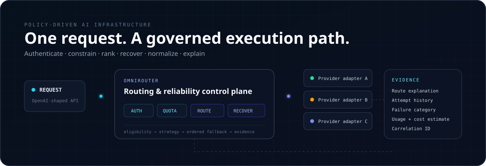
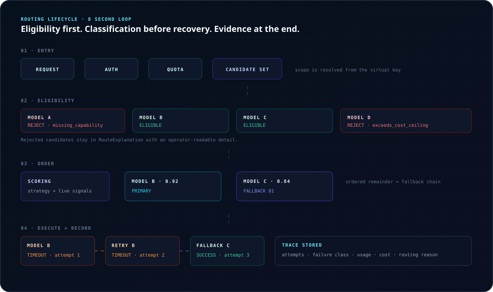
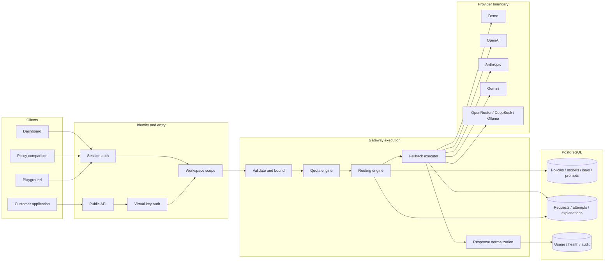
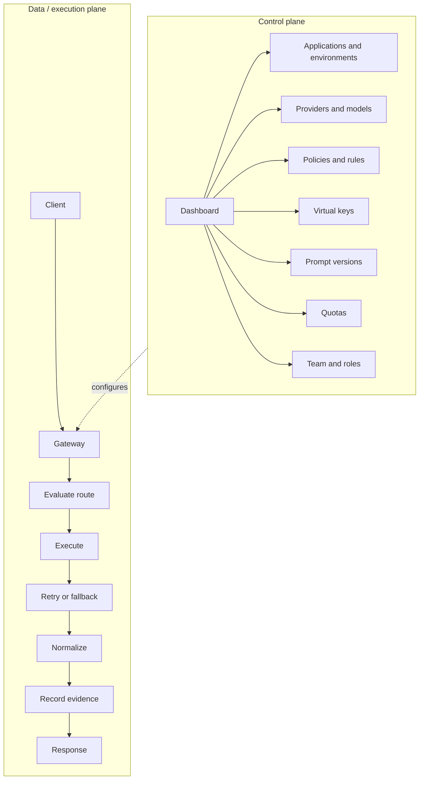
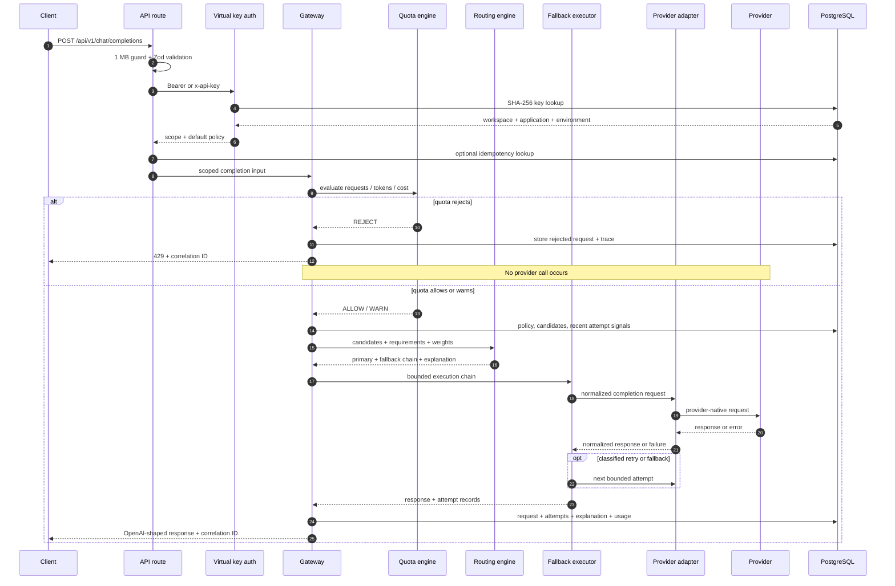
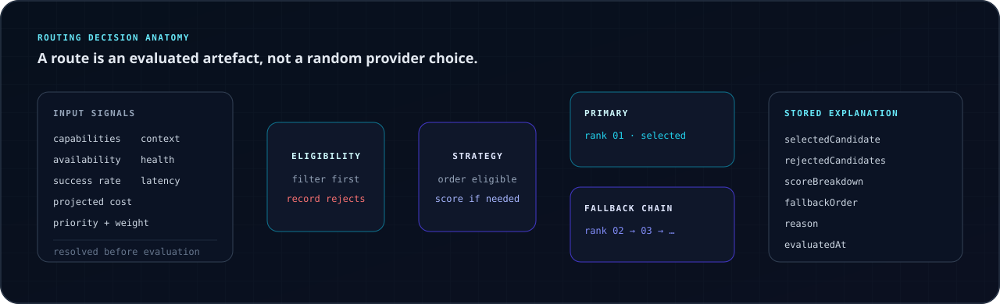
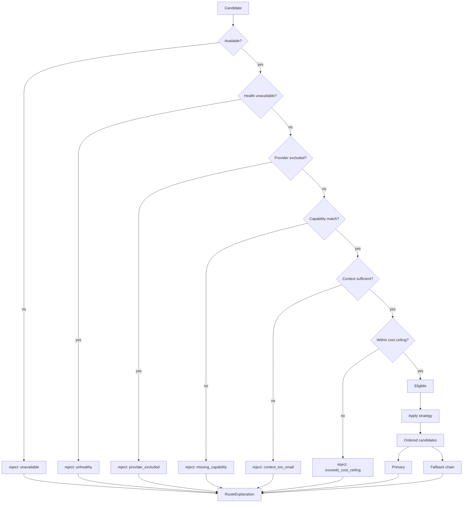
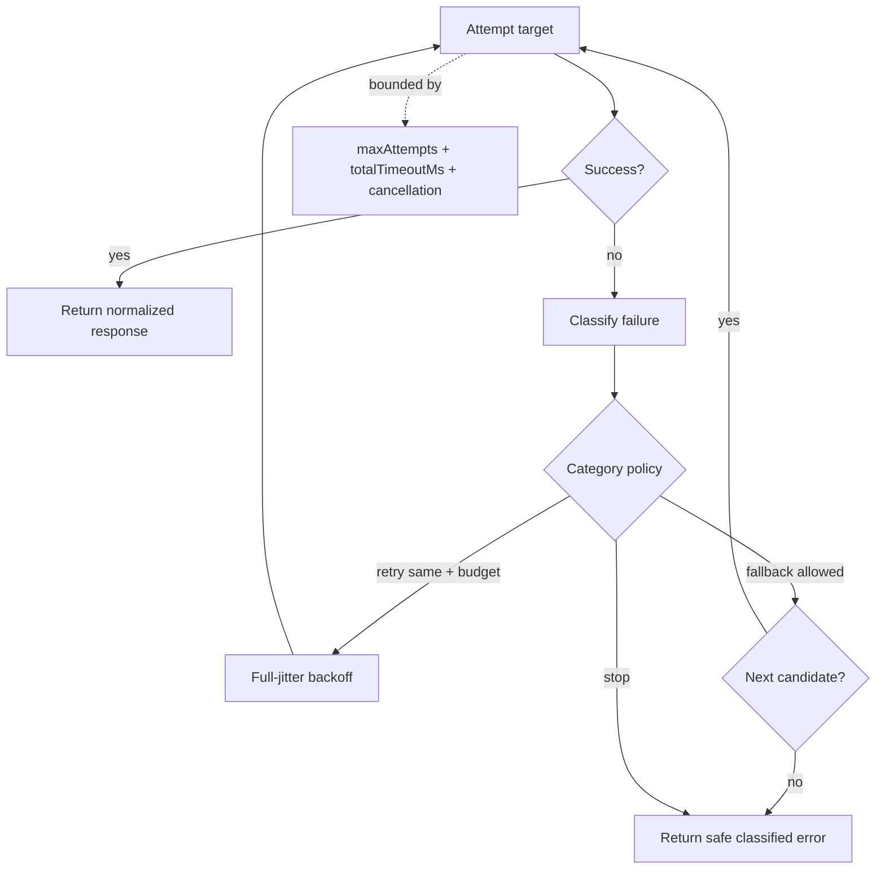
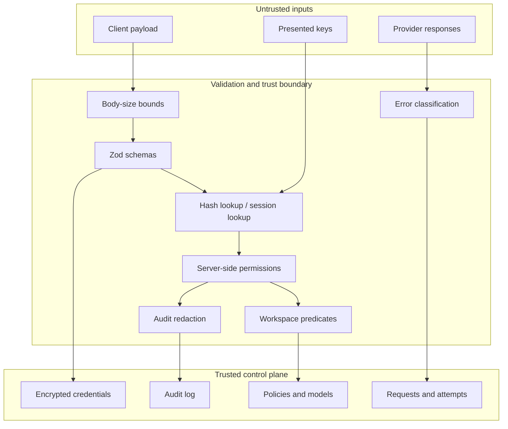
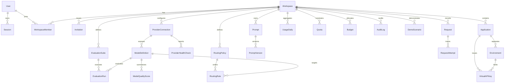

<div align="center">



# OmniRouter

### AI Model Gateway, Routing &amp; Reliability Control Plane

One OpenAI-shaped endpoint for policy-driven model selection across providers. OmniRouter authenticates virtual keys, enforces usage constraints, explains every routing decision, executes bounded retry and fallback, normalizes provider behavior, and persists the evidence operators need.

[**Demo**](https://omnirouter-ai.vercel.app) · [**30-second model**](#30-second-mental-model) · [**Architecture**](#architecture) · [**API**](#api) · [**Security**](#security-architecture) · [**Quickstart**](#local-development)

[](#testing) [](#technical-specifications) [](#technical-specifications) [](#data-architecture) [](LICENSE)

</div>


> **Deterministic demo, real execution path.** The configured [demo deployment](https://omnirouter-ai.vercel.app) uses fictional in-process models, so routing and failure scenarios are repeatable and no prompt is sent to an external AI service. The API, playground, comparison workflow, and demo all enter the same `runCompletion` gateway path.

<details>
<summary><strong>Demo roles and guided walkthrough</strong></summary>

The repository-configured walkthrough is available at [`/demo/story`](https://omnirouter-ai.vercel.app/demo/story).

| Account | Role | Useful surface |
| --- | --- | --- |
| `owner@omnirouter.demo` | Owner | Complete workspace view |
| `admin@omnirouter.demo` | Admin | Operations without workspace deletion |
| `developer@omnirouter.demo` | Developer | Playground, prompts, development keys |
| `viewer@omnirouter.demo` | Viewer | Read-only authorization boundary |

Demo password: `OmniDemo!2026`. The seeded workspace is marked as protected and destructive demo operations are refused server-side.

</details>

## Contents

- [Why OmniRouter](#why-omnirouter) · [Mental model](#30-second-mental-model) · [Capabilities](#control-plane-capabilities)
- [Architecture](#architecture) · [Request lifecycle](#request-lifecycle) · [Routing engine](#routing-engine)
- [Routing strategies](#routing-strategies) · [Worked decision](#worked-routing-decision) · [Fallback](#failure-and-fallback-engine)
- [Providers](#provider-abstraction) · [Explainability](#every-routing-decision-leaves-evidence) · [Observability](#usage-cost-and-observability)
- [Quotas](#quotas-and-cost-controls) · [Virtual keys](#virtual-api-keys) · [Prompts](#prompt-registry)
- [Security](#security-architecture) · [Data](#data-architecture) · [Product](#product-walkthrough)
- [API](#api) · [Specifications](#technical-specifications) · [Testing](#testing)
- [Deployment](#deployment-architecture) · [Repository](#repository-structure) · [Development](#local-development) · [Docs](#documentation)

## 30-second mental model

Your application sends one chat-completion request. OmniRouter:

1. validates the payload and authenticates the virtual key;
2. derives workspace, application, and environment scope from that key;
3. checks key scope, expiry, and configured quotas;
4. loads the active policy and resolves recent runtime signals;
5. removes unavailable, excluded, incapable, undersized, or over-budget candidates;
6. ranks the eligible set according to the operator's strategy;
7. selects the head as primary and retains the ordered remainder as fallback;
8. executes through a provider adapter;
9. classifies any failure before deciding whether to retry, fall back, or stop;
10. bounds work by attempt and total-time budgets;
11. normalizes the successful provider response;
12. stores the route explanation, stages, attempts, usage, latency, and estimated cost;
13. returns an OpenAI-shaped response with a correlation identifier.



### Application view vs. operator view

| Application view | Operator view |
| --- | --- |
| `POST /api/v1/chat/completions`<br />↓<br />assistant response | Request<br />├─ virtual-key authentication<br />├─ quota evaluation<br />├─ policy and strategy<br />├─ eligible and rejected candidates<br />├─ primary and fallback order<br />├─ attempt 1 → timeout<br />├─ attempt 2 → timeout<br />├─ attempt 3 → fallback → success<br />└─ tokens, latency, estimated cost, explanation |

The caller receives one stable contract. The operator receives the complete degraded execution path.

## Why OmniRouter

Direct provider integration looks simple until model choice becomes operational policy. As applications multiply, provider calls accumulate fragmented credentials, inconsistent retries, implicit fallback behavior, duplicated cost logic, difficult migrations, and model-selection branches embedded in product code.

> ### Model selection is a policy decision, not application business logic.

OmniRouter separates those concerns. Applications express a workload; the control plane owns which eligible model should serve it and how failure is handled.

The central design choice is stronger than recording the winning model: **persist why it won**. A `RouteExplanation` accounts for the candidate set, rejection reasons, live signals, strategy, score breakdown, selected target, fallback order, and evaluation time. `RequestAttempt` rows then record execution sequence, failure categories, latency, usage, and cost. A routing decision remains inspectable after its policy changes.

## Control-plane capabilities

| Surface | Verified behavior | Why it exists |
| --- | --- | --- |
| Applications and environments | Workspace applications contain separate `DEVELOPMENT` and `PRODUCTION` environments with environment-default policies. | Consumers get isolated configuration and credentials without embedding tenant identifiers in requests. |
| Provider connections and model catalog | Seven registered adapters; model records carry context, capabilities, prices, availability, and health state. | Provider-specific configuration stops at a controlled boundary. |
| Routing policies | Eight strategies share one eligibility pipeline and produce a stored explanation. | Operators can change model-selection intent without changing application code. |
| Unified gateway | Validated OpenAI-shaped request/response contract, policy selection, idempotency for non-streaming calls, and correlation headers. | Existing clients need one stable integration surface. |
| Playground and policy comparison | Both actions call the production gateway function; deterministic fault injection is restricted to the demo provider. | Engineers can inspect selection and recovery without maintaining a second execution path. |
| Request explorer and traces | Requests, lifecycle stages, every attempt, classification, fallback, usage, and route evidence are queryable. | Degraded success is visible instead of disappearing behind a `200`. |
| Analytics | Requests, status, fallback rate, mean/P50/P95 latency, tokens, estimated cost, and model/provider/error distributions derive from stored rows. | Operations are based on execution evidence rather than synthetic charts. |
| Quotas and cost ceilings | Request, token, and estimated-cost limits across minute/day/month windows; policy-level maximum projected cost. | A rejected request stops before provider execution, while warning thresholds remain observable. |
| Virtual API keys | One-time plaintext, SHA-256 lookup, display prefix, environment/application binding, scopes, expiry, and revocation. | Applications never receive provider credentials. |
| Prompt registry | Prompt and immutable version rows with an explicit active-version pointer. | Prompt iteration is inspectable without rewriting historical versions. |
| Team roles and audit | Five server-enforced workspace roles; audit snapshots recursively redact sensitive values. | Presentation controls do not substitute for authorization or evidence. |
| Provider health | Current connection/model health and stored health-check history feed routing signals and the health dashboard. | Availability can influence selection without leaking provider logic into callers. |

## Architecture



### Control plane vs. execution plane



The control plane changes policy and scope. The execution plane consumes that configuration for each request. Neither the prompt nor arbitrary request metadata is trusted to choose a workspace.

## Request lifecycle



Key invariants:

- A quota-rejected request never reaches a provider.
- Workspace, application, and environment are derived from the authenticated key or session context.
- A named policy is accepted only when it is active in the key's workspace.
- Non-streaming idempotency is workspace-scoped; a replay returns `409` with the original correlation ID.
- Provider-supplied error text is replaced by category-specific safe wording.

## Routing engine

Eligibility always precedes optimization. Every strategy uses the same filters; only the ordering step changes.





Candidates that pass filtering but rank below the winner are recorded as `not_selected` and retained for fallback. The exact rejection vocabulary is:

`disabled` · `unavailable` · `unhealthy` · `missing_capability` · `context_too_small` · `exceeds_cost_ceiling` · `not_selected` · `provider_excluded`

`evaluateRoute` is pure and synchronous. Database reads and rolling signals happen before the call; health, recent mean latency, recent success rate, sample size, and projected request cost are injected as candidate data. This makes selection deterministic under controlled inputs and independently unit-testable.

### Balanced scoring

`BALANCED` normalizes each factor to `[0,1]`, multiplies it by the configured weight, and stores every contribution. Defaults are:

| Factor | Default weight | Higher score means |
| --- | ---: | --- |
| Health | `0.25` | Better current health state |
| Recent success rate | `0.25` | Larger success share |
| Recent latency | `0.20` | Lower measured mean latency |
| Projected cost | `0.20` | Lower request-specific estimate |
| Operator preference | `0.10` | Lower configured priority number |

Missing success history is neutral (`0.5`); a candidate with no latency samples ranks behind measured candidates in latency-first routing. The score expresses configured preference—it does not claim to identify an objectively best model.

## Routing strategies

<details open>
<summary><strong>Eight implemented strategies</strong></summary>

| Strategy | Optimizes for | Inputs and behavior | Determinism |
| --- | --- | --- | --- |
| `MANUAL` | Explicit model selection | Pins `requestedModelId`; shared eligibility rules still apply. | Deterministic |
| `PRIORITY` | Operator order | Lowest priority number first; label breaks ties. | Deterministic |
| `WEIGHTED` | Traffic preference | Weighted random selection without replacement orders both primary and fallback. | Seedable random |
| `LOWEST_ESTIMATED_COST` | Request cost | Lowest projected cost; priority breaks ties. | Deterministic |
| `LOWEST_RECENT_LATENCY` | Measured response time | Recent successful mean; models without evidence rank after measured models. | Deterministic |
| `RELIABILITY_FIRST` | Health and success | Health state, then recent success rate, then priority. | Deterministic |
| `CAPABILITY_MATCH` | Capacity after eligibility | Largest context window among candidates satisfying every requirement. | Deterministic |
| `BALANCED` | Weighted trade-off | Health, success, latency, cost, and preference with stored contributions. | Deterministic |

</details>

## Worked routing decision

Consider the seeded **Balanced production** policy. Its verified rules attach `astra-fast` at priority `1`, `astra-pro` at `2`, and `local-ember` at `3`. The following condensed example uses the repository's real demo model definitions and the actual `RouteExplanation` field names:

| Candidate | Catalog facts | Evaluation |
| --- | --- | --- |
| `astra-fast` | 32k context; streaming + structured output; lowest non-zero configured price | Eligible and ranked primary for this request |
| `astra-pro` | 200k context; streaming + structured output + vision + tools | Eligible; retained in fallback order |
| `local-ember` | 8k context; streaming; zero external charge modeled | Rejected when structured output is required |

```json
{
  "policyName": "Balanced production",
  "strategy": "BALANCED",
  "selectedCandidate": {
    "modelId": "<model-definition-id>",
    "modelLabel": "astra-fast",
    "providerKind": "DEMO"
  },
  "rejectedCandidates": [
    {
      "modelId": "<model-definition-id>",
      "modelLabel": "local-ember",
      "reason": "missing_capability",
      "detail": "Does not support required capability: structured_output."
    },
    {
      "modelId": "<model-definition-id>",
      "modelLabel": "astra-pro",
      "reason": "not_selected",
      "detail": "Eligible, but ranked below the selected target. Retained for fallback."
    }
  ],
  "scoreBreakdown": [
    {
      "modelLabel": "astra-fast",
      "score": "<sum of stored contributions>",
      "components": [
        { "factor": "health", "raw": 1, "normalised": 1, "weight": 0.25, "contribution": 0.25 }
      ]
    }
  ],
  "fallbackOrder": ["astra-pro"],
  "reason": "Astra Fast scored highest against the configured scoring policy. 2 candidates were eligible.",
  "evaluatedAt": "<ISO-8601 timestamp>"
}
```

The numeric placeholders are request-time values, not benchmarks. The important contract is that candidate accounting, component weights, selection reason, and fallback order are stored with the request.

## Failure and fallback engine

**Failure is not equivalent to retry.** An adapter first maps provider behavior into a normalized category. The executor then looks up the category-specific policy.



| Failure category | Retry same target | Fallback | Operational reason |
| --- | ---: | ---: | --- |
| `AUTHENTICATION` | No | Yes | Repetition cannot repair credentials. |
| `PERMISSION` | No | Yes | Retrying cannot grant model access. |
| `RATE_LIMIT` | 1× | Yes | One backed-off retry covers a transient limit. |
| `TIMEOUT` | 1× | Yes | One retry covers transient slowness without creating an open-ended duplicate risk. |
| `PROVIDER_UNAVAILABLE` | No | Yes | Move immediately instead of waiting on a reported outage. |
| `INVALID_REQUEST` | No | No | The request will fail identically elsewhere. |
| `CONTEXT_LIMIT` | No | Yes | Move only to the ordered chain; content is never silently truncated. |
| `SAFETY_REFUSAL` | **No** | **No** | The gateway does not shop a refused prompt to another provider. |
| `MALFORMED_RESPONSE` | 1× | Yes | A schema-invalid response may recover once, then moves on. |
| `NETWORK` | 1× | Yes | Retry one transient transport fault, then fall back. |
| `QUOTA_EXCEEDED` | No | No | This is a control-plane rejection, not a provider fault. |
| `UNKNOWN` | No | Yes | One move without repeating an unclassified condition. |
| `CLIENT_CANCELLED` | No | No | Stop spending when the caller disconnects. |

Retry delay uses full jitter: a random duration from zero to the exponential ceiling. Every loop consumes an attempt or exits, and execution is independently capped by `maxAttempts` and `totalTimeoutMs`. Routing policy validation bounds those values to `1–6` attempts, `1–120 s` per attempt, and `1–300 s` total.

### A failure story


```text
Attempt 1   astra-fast    TIMED_OUT   1,503 ms   Primary target selected by policy
Attempt 2   astra-fast    TIMED_OUT   1,504 ms   Retry 1 after a retryable failure
Attempt 3   local-ember   SUCCEEDED     841 ms   Fallback target
```

These values come from the repository's seeded demo trace. From the application's perspective: one normal completion. From the operator's perspective: two timeouts, the applicable retry rule, a model transition, the successful attempt, and the aggregate cost/latency record.

## Provider abstraction

Seven adapters implement one `ProviderAdapter` contract: model discovery, health check, completion, streaming completion, token estimation, capability checks, and error normalization.

| Provider | Adapter path | Credential | Streaming method | Normalization |
| --- | --- | --- | --- | --- |
| Demo | In-process deterministic adapter | None | Deterministic chunks | Fictional models, deterministic content and scoped fault injection |
| OpenAI | OpenAI-compatible adapter | Bearer key | Provider stream | Choice, usage, finish reason, and HTTP errors |
| Anthropic | Dedicated Messages adapter | API key | Provider stream | Content blocks, usage, finish reason, and errors |
| Gemini | Dedicated Generative Language adapter | API key | Buffered word-chunk replay | Candidates, usage, finish reason, and errors |
| OpenRouter | OpenAI-compatible adapter | Bearer key | Provider stream | Shared OpenAI-compatible envelope |
| DeepSeek | OpenAI-compatible adapter | Bearer key | Provider stream | Shared OpenAI-compatible envelope |
| Ollama | OpenAI-compatible local adapter | Base URL; no key required | Provider stream | Shared envelope over a self-hosted endpoint |

```text
provider-specific request              provider-specific response / error
            │                                        │
            ▼                                        ▼
      ProviderAdapter  ─────────────────────► normalized response / failure
```

Credential-backed adapters can resolve an encrypted workspace credential or a provider-specific environment variable. Ollama stores a base URL rather than an API key. The deterministic provider uses the same gateway contract and is explicitly fictional; its cost and latency values are demonstrations, not comparisons with real models.

## Every routing decision leaves evidence

```text
Request  <correlation-id>
│
├─ ROUTE
│  ├─ policy: Balanced production
│  ├─ strategy: BALANCED
│  ├─ selected: astra-fast
│  ├─ rejected: local-ember → missing_capability
│  ├─ lower-ranked: astra-pro → not_selected
│  └─ fallback: astra-pro
│
├─ EXECUTION
│  ├─ attempt 1 → astra-fast → TIMEOUT
│  ├─ attempt 2 → astra-fast → TIMEOUT
│  └─ attempt 3 → astra-pro  → SUCCEEDED
│
└─ RESULT
   ├─ status + safe failure category
   ├─ input / output / total tokens
   ├─ total latency
   ├─ estimated cost
   └─ ordered trace stages
```

`Request` is the aggregate outcome. `RequestAttempt` is the execution history. Keeping them separate prevents a successful fallback from erasing the failure that made it necessary.

## Usage, cost, and observability

Operators can query:

- total, succeeded, failed, and rejected requests;
- success and fallback rates;
- average, P50, and P95 latency for successful requests;
- input, output, and total tokens;
- estimated cost from provider-reported or heuristic usage plus workspace-configured prices;
- request trends and fallback trends by day;
- attempts by model and provider;
- request distribution by application; and
- failures grouped by normalized category.

Percentiles are computed from up to the latest 5,000 successful request rows in the selected window. Model and provider distributions derive from `RequestAttempt`, so failed primary calls and successful fallback calls remain distinguishable. `UsageDaily` maintains an environment-grain rollup through an atomic upsert.


Cost is deliberately named `estimatedCost`: provider-reported usage is preferred, token heuristics are used when usage is absent, and configured per-million prices may differ from a provider invoice.

## Quotas and cost controls

```text
Authenticated scope ──► current request / token / cost usage
                                      +
                              configured quota
                                      │
                         ┌────────────┴────────────┐
                         ▼                         ▼
                      ALLOW/WARN                 REJECT
                         │                         │
                      route request         store rejection
                                             no provider call
```

Quota records can apply at workspace, application, or environment scope. Supported dimensions are requests, tokens, and estimated cost; windows are `MINUTE`, `DAY`, and `MONTH`. Each dimension may be unlimited, a fractional warning threshold is supported, and the most restrictive matching result wins. Actions are `WARN`, `REJECT`, and `ROUTE_LOWER_COST`; only `REJECT` blocks execution in the current gateway, while the others allow the request and surface quota detail. Routing policies independently enforce `maxEstimatedCost` during candidate eligibility.

## Virtual API keys

```text
Application
    │  omr_dev_… / omr_live_…
    ▼
Virtual OmniRouter key ──► SHA-256 lookup ──► workspace / app / environment scope
                                                    │
                                                    ▼
Gateway ──► decrypt selected provider credential ──► Provider
```

- Keys contain an environment segment and 24 URL-safe random characters.
- Plaintext is returned once at creation; only `keyHash` and a 14-character display prefix are stored.
- `Authorization: Bearer …` and `x-api-key` are accepted.
- Empty scopes mean unrestricted; populated scopes are an allowlist. The gateway requires `chat.completions`.
- Status, expiration, revocation, and last-use time are persisted.
- The key record binds workspace, application, and environment, so these scopes are not accepted from the body.

Provider credentials are a separate secret class: encrypted at rest with AES-256-GCM and never issued to applications.

## Prompt registry

```text
Prompt
├─ v1
├─ v2
└─ v3  ◄── activeVersionId
```

`PromptVersion` rows carry a monotonically unique version number per prompt, system prompt, user template, declared variables, change note, test cases, and creation time. `Prompt.activeVersionId` moves independently. This structure preserves version history and makes an active prompt selection explicit; it does not imply that every gateway request is automatically linked to a prompt version.

## Security architecture



| Boundary | Verified control |
| --- | --- |
| Passwords | scrypt with `N=16384`, `r=8`, `p=1`, 16-byte salt, 64-byte derived key; parameters embedded in the stored value. |
| Sessions | 32-byte opaque token in a seven-day `httpOnly`, `sameSite=lax` cookie; SHA-256 stored server-side; revocable; production cookie is `secure`. |
| Login abuse | Five failed logins lock the account for 15 minutes; the counter is stored on the user record. |
| Virtual keys | SHA-256 lookup, one-time plaintext, non-authenticating prefix, expiry, revocation, scopes, and tenant binding. |
| Provider secrets | AES-256-GCM, exactly 32-byte base64 key, random 12-byte IV, authenticated tag, `iv:tag:ciphertext` storage. |
| Tenant isolation | Server-resolved membership/key context plus `workspaceId` predicates; foreign tenant records use the same not-found behavior. |
| RBAC | `OWNER`, `ADMIN`, `DEVELOPER`, `ANALYST`, and `VIEWER`; server-side permission checks and role-assignment rank rules. |
| Request validation | 1 MB declared body bound; 1–64 messages; 32,000 characters per message; 200,000 total; bounded model/policy names and generation settings. |
| Provider errors | Adapter classification and category-safe client messages; raw provider text is not forwarded. |
| Request content | Workspace default is `METADATA_ONLY`; integration tests assert prompt and response previews remain null on that path. |
| Audit | Recursive, case-insensitive sensitive-key redaction to depth six; application module exposes create helpers, not update/delete helpers. |

No certification claim is made. The repository documents controls and threat assumptions in [Security Model](docs/SECURITY_MODEL.md), [Threat Model](docs/THREAT_MODEL.md), and [Privacy Model](docs/PRIVACY_MODEL.md).

## Data architecture

The current Prisma schema contains **25 models**. The diagram is deliberately simplified around the ownership and execution relationships rather than reproducing every column.



Important persistence decisions:

- Tenant-owned operational tables carry `workspaceId`, keeping isolation to an indexed predicate.
- `Request` stores the aggregate outcome; `RequestAttempt` stores the ordered execution path.
- Varying structures use PostgreSQL JSONB: policy requirements/scoring, route explanation, trace stages, prompt test cases, and audit snapshots.
- Stable identities, ownership, statuses, counters, and relationships remain relational and constrained.
- `UsageDaily` aggregates by workspace/application/environment/day; per-model analysis uses attempts because every attempt carries the actual model.
- Audit records are append-only by application construction; direct database access remains outside that application-layer guarantee.

## Product walkthrough

<table>
  <tr>
    <td width="50%"><br /><strong>Policy builder</strong> — configure strategy, attempt/time budgets, and ordered model rules without changing caller code.</td>
    <td width="50%"><br /><strong>Gateway playground</strong> — execute through the same gateway and deliberately exercise classified demo failures.</td>
  </tr>
  <tr>
    <td width="50%"><br /><strong>Request explorer</strong> — filter persisted executions and open the evidence behind an outcome.</td>
    <td width="50%"><br /><strong>Usage analytics</strong> — correlate traffic, fallback, latency, token, cost, model, provider, and failure distributions.</td>
  </tr>
</table>

The overview screenshot at the top and fallback trace in the reliability section complete the six selected product surfaces; all are existing repository assets rather than manufactured screens.

## API

### Chat completion

```bash
curl -X POST https://your-deployment.example/api/v1/chat/completions \
  -H "Authorization: Bearer $OMNIROUTER_KEY" \
  -H "Content-Type: application/json" \
  -H "Idempotency-Key: ticket-4821-summary" \
  -d '{
    "messages": [
      { "role": "system", "content": "You are a concise support assistant." },
      { "role": "user", "content": "Summarize this support thread." }
    ],
    "max_tokens": 400,
    "temperature": 0.2,
    "policy": "Balanced production"
  }'
```

The key may also be supplied as `x-api-key`. `model` pins a model and switches routing to `MANUAL`; `policy` selects an active policy in the authenticated workspace. `response_format` accepts `{ "type": "json_schema", "json_schema": { "schema": { ... } } }`.

```json
{
  "id": "ed190580-fd01-44a3-9e46-eb20fe7f435e",
  "object": "chat.completion",
  "created": 1787184000,
  "model": "astra-fast",
  "choices": [
    {
      "index": 0,
      "message": { "role": "assistant", "content": "…" },
      "finish_reason": "stop"
    }
  ],
  "usage": {
    "prompt_tokens": 10,
    "completion_tokens": 63,
    "total_tokens": 73
  },
  "omnirouter": {
    "correlation_id": "ed190580-fd01-44a3-9e46-eb20fe7f435e",
    "provider": "DEMO",
    "fallback_used": false,
    "attempts": 1,
    "estimated_cost": 0.000039,
    "latency_ms": 540,
    "policy": "Balanced production",
    "strategy": "BALANCED",
    "routing_reason": "Astra Fast scored highest against the configured scoring policy."
  }
}
```

Success and post-authentication failure responses carry:

```text
x-omnirouter-correlation-id: <uuid>
x-omnirouter-fallback-used:  true | false
x-omnirouter-attempts:       <count>
x-omnirouter-quota-warning:  <detail>   # when applicable
```

These `omnirouter` names are part of the current API contract and are intentionally preserved.

### Streaming

`POST /api/v1/chat/completions/stream` requires `"stream": true` and returns Server-Sent Events. Streaming emits normalized `{ "delta", "done" }` chunks and a terminal event, uses the same key/policy/quota/routing path, persists its execution trace, and does not accept `Idempotency-Key`.

Full contract: [API Reference](docs/API_REFERENCE.md).

## Technical specifications

<details open>
<summary><strong>Gateway and routing</strong></summary>

| Area | Specification |
| --- | --- |
| API style | OpenAI-shaped non-streaming response plus namespaced `omnirouter` routing metadata |
| Request validation | Zod; 1 MB declared body; explicit array, string, and generation bounds |
| Authentication | Virtual key through Bearer or `x-api-key`; SHA-256 database lookup |
| Tenant scope | Workspace/application/environment derived from authenticated context |
| Idempotency | Optional non-streaming `Idempotency-Key`; at-most-once lookup per workspace; replay `409` |
| Streaming | Dedicated SSE route at `/api/v1/chat/completions/stream`; idempotency is intentionally rejected on this route |
| Strategies | Eight: manual, priority, weighted, cost, latency, reliability, capability, balanced |
| Eligibility | Availability, unavailable health, provider exclusion, capabilities, context, projected-cost ceiling |
| Live signals | Health state, recent successful mean latency, recent success rate, sample size |
| Explanation | All candidates, rejections, selected candidate, score components, reason, fallback order, time |

</details>

<details>
<summary><strong>Reliability and observability</strong></summary>

| Area | Specification |
| --- | --- |
| Failure taxonomy | 13 categories including client cancellation |
| Retry policy | Per category; retryable categories allow at most one same-target retry |
| Fallback | Ordered remainder from the routing decision; blocked for invalid request, safety refusal, quota, cancellation |
| Bounds | Policy max attempts `1–6`; per-attempt timeout `1–120 s`; total timeout `1–300 s` |
| Backoff | Exponential ceiling with full jitter; provider `retryAfterMs` takes precedence |
| Trace | Ordered lifecycle stages plus request and attempt rows |
| Metrics | Status, fallback, average/P50/P95 latency, tokens, estimated cost, model/provider/application/error distributions |
| Usage | Provider usage preferred; heuristic estimate used when absent; successful attempt is billable in the gateway model |

</details>

<details>
<summary><strong>Security and data</strong></summary>

| Area | Specification |
| --- | --- |
| Passwords | scrypt, salted, embedded parameters, timing-safe verification |
| Sessions | Database-backed opaque token, SHA-256 stored, seven-day `httpOnly` cookie |
| Virtual keys | SHA-256 stored, one-time plaintext, scopes, expiry, revocation, app/environment binding |
| Provider credentials | AES-256-GCM with random 12-byte IV and authentication tag |
| Tenant isolation | Indexed `workspaceId` ownership and server-resolved scope |
| RBAC | Five roles and granular server-side permissions |
| Default retention | Metadata-only request logging path |
| Audit | Redacted JSON snapshots; no update/delete helper in the application module |
| Database | PostgreSQL 16; Prisma 7 with the `pg` driver adapter; 25 schema models |
| JSON usage | Variable policy, trace, explanation, prompt test, and audit structures only |

</details>

<details>
<summary><strong>Stack</strong></summary>

| Layer | Verified choice |
| --- | --- |
| Framework | Next.js `16.2.12`, App Router, Node.js route runtime |
| UI | React `19.2.8`, Tailwind CSS `4.3.3`, Recharts, Lucide |
| Language | TypeScript `6.0.3`, `strict`, `noUncheckedIndexedAccess`, `noImplicitOverride` |
| Validation | Zod `4.4.3` |
| Data | PostgreSQL 16, Prisma `7.9.1`, `@prisma/adapter-pg` |
| Tests | Vitest `4.1.10`; Playwright `1.62.1` is present as a development dependency |
| CI | GitHub Actions on Node.js 22 with PostgreSQL 16 service |
| Documented deployment | Vercel application + Supabase PostgreSQL |

</details>

## Testing

The current test files declare **124 test cases**:

| Suite | Count | Important invariants exercised |
| --- | ---: | --- |
| Unit | 87 | Eligibility and all eight strategies; complete candidate accounting; bounded fallback; classification; jitter; token/cost math; encryption; passwords; virtual keys; RBAC; redaction |
| Integration | 14 | Gateway persistence; route explanation and trace; deterministic demo output; metadata-only logging; retry/fallback; safety refusal; usage rollup; quota rejection/warning |
| Security | 23 | Workspace isolation; scoped policy/application lookup; key indistinguishability; ciphertext storage; request bounds; prompt text cannot alter routing; safe errors |

The seed verifier adds **18 named checks** covering accounts, applications, policies, demo models, virtual keys, quotas, prompts, seeded requests, fallback, terminal failure, route evidence, attempts, safety refusal, and metadata-only logging.

```bash
npm run test              # 87 unit tests
npm run test:integration  # 14 integration tests; PostgreSQL required
npm run test:security     # 23 security tests; PostgreSQL required
npm run demo:verify       # 18 seeded-demo checks
npm run verify            # format + lint + types + unit + production build
```

CI additionally generates Prisma, applies migrations, runs all three test projects, seeds and verifies the demonstration, and creates a production build against an ephemeral PostgreSQL 16 service.

## Deployment architecture

The repository documents this release path:

```text
GitHub
├─ GitHub Actions → Node.js 22 → PostgreSQL 16 service → verify + demo check + build
└─ Vercel         → Next.js application → pooled DATABASE_URL
                                      └─ Supabase PostgreSQL
                                         └─ direct DIRECT_URL for migrations
```

Runtime uses the pooled database connection; Prisma Migrate uses the direct connection because DDL must bypass the pooler. Dashboard routes are dynamic because they read live workspace data. The demo seed is explicit, refuses to run when `DEMO_MODE=false`, and is never part of every build.

See [Deployment](docs/DEPLOYMENT.md) for environment setup and operating checks.

## Repository structure

```text
OmniRouter/
├── app/
│   ├── (dashboard)/dashboard/        # operator surfaces
│   ├── api/v1/chat/completions/      # unified and SSE gateway routes
│   └── demo/                         # deterministic guided workflows
├── components/                       # dashboard and design-system components
├── lib/
│   ├── ai/
│   │   ├── routing/                  # pure eligibility and ranking
│   │   ├── fallback/                 # bounded classified recovery
│   │   └── providers/                # adapter boundary
│   ├── api-keys/                     # virtual-key generation and auth
│   ├── auth/                         # sessions, passwords, guards
│   ├── quotas/                       # pre-provider usage evaluation
│   ├── analytics/                    # persisted operational queries
│   ├── audit/                        # append-only writes and redaction
│   └── permissions/                  # role-to-permission policy
├── prisma/                           # 25-model schema, migration, seed scenarios
├── tests/                            # unit, integration, security
├── portfolio/screenshots/            # real product captures
└── docs/                             # architecture and operating references
```

## Local development

Prerequisites: Node.js 22, npm, Docker, and Git.

```bash
git clone https://github.com/arslanvuzmal/ModelSwitchyard.git omnirouter
cd omnirouter
npm ci

cp .env.example .env
# Replace AUTH_SECRET, ENCRYPTION_KEY, and INTERNAL_API_SECRET.
# ENCRYPTION_KEY must decode to exactly 32 bytes.

npm run db:up       # PostgreSQL 16 at localhost:5435
npm run db:deploy   # apply committed migrations
npx tsx prisma/seed/index.ts
npm run dev
```

Open <http://localhost:3000> and use the seeded demo account. No external provider key is required while `DEMO_MODE=true`.

<details>
<summary><strong>Environment variables</strong></summary>

| Variable | Required by current setup | Purpose |
| --- | ---: | --- |
| `DATABASE_URL` | Yes | Runtime PostgreSQL connection; pooled in the documented serverless deployment |
| `DIRECT_URL` | Yes | Direct connection used by Prisma Migrate |
| `AUTH_SECRET` | Yes | Minimum 32-character server secret used to salt IP correlation hashes |
| `ENCRYPTION_KEY` | Yes | Base64 value decoding to exactly 32 bytes for AES-256-GCM |
| `INTERNAL_API_SECRET` | Template | Maintenance endpoint secret |
| `APP_URL` | Template | Application origin; local default is port 3000 |
| `DEMO_MODE` | Demo only | Enables deterministic provider, seed, and demo accounts |
| `NEXT_PUBLIC_DEMO_MODE` | Demo UI | Exposes demo-mode presentation state |
| `DEMO_PASSWORD` | Seed | Password assigned to fictional demo accounts |
| `OPENAI_API_KEY` | Optional | Environment fallback for OpenAI connection |
| `ANTHROPIC_API_KEY` | Optional | Environment fallback for Anthropic connection |
| `GEMINI_API_KEY` | Optional | Environment fallback for Gemini connection |
| `OPENROUTER_API_KEY` | Optional | Environment fallback for OpenRouter connection |
| `DEEPSEEK_API_KEY` | Optional | Environment fallback for DeepSeek connection |
| `OLLAMA_BASE_URL` | Optional | Self-hosted Ollama endpoint |

</details>

## Design principles

1. **Model selection is policy, not application logic.** Callers describe a workload; operators own the routing decision.
2. **Eligibility precedes optimization.** An incapable or prohibited candidate cannot win by scoring well elsewhere.
3. **Every decision should be explainable.** Selected, rejected, and lower-ranked candidates all leave evidence.
4. **Failure is classified before reaction.** Retry and fallback depend on semantics, not a blanket loop.
5. **Recovery is bounded.** Attempt count, per-attempt timeout, total timeout, and cancellation all terminate work.
6. **Fallback does not bypass safety decisions.** `SAFETY_REFUSAL` stops by default.
7. **Tenant scope comes from authenticated context.** Payload fields cannot select another workspace.
8. **Provider differences stop at adapter boundaries.** Routing, tracing, cost, and analytics consume normalized contracts.
9. **Demonstration and API share the gateway.** Reproducibility comes from the provider, not a parallel application path.
10. **Operational events become queryable records.** Explanations and attempts survive beyond transient logs.

## Documentation

| Document | Purpose |
| --- | --- |
| [Architecture](docs/ARCHITECTURE.md) | System topology, lifecycle, fallback, data, security, deployment |
| [API Reference](docs/API_REFERENCE.md) | Request/response contract, headers, idempotency, and errors |
| [Routing Engine](docs/ROUTING_ENGINE.md) | Eligibility, eight ordering strategies, and scoring semantics |
| [Fallback Engine](docs/FALLBACK_ENGINE.md) | Failure taxonomy, bounded executor, backoff, and safety behavior |
| [Provider Adapters](docs/PROVIDER_ADAPTERS.md) | Adapter interface and seven registered providers |
| [Database Design](docs/DATABASE_DESIGN.md) | Relational ownership, indexes, JSONB boundaries, and aggregates |
| [Security Model](docs/SECURITY_MODEL.md) | Authentication, encryption, isolation, authorization, and redaction |
| [Threat Model](docs/THREAT_MODEL.md) | Assets, adversaries, mitigations, and accepted risk |
| [Privacy Model](docs/PRIVACY_MODEL.md) | Metadata retention, secret storage, and deletion behavior |
| [Decisions](docs/DECISIONS.md) | Architectural choices and their trade-offs |
| [Test Plan](docs/TEST_PLAN.md) | Suite boundaries and high-value invariants |
| [Deployment](docs/DEPLOYMENT.md) | Vercel, Supabase, migrations, seed, and operating checks |

## License and author

[MIT](LICENSE) · Built by **Arslan Vuzmal Lone**
